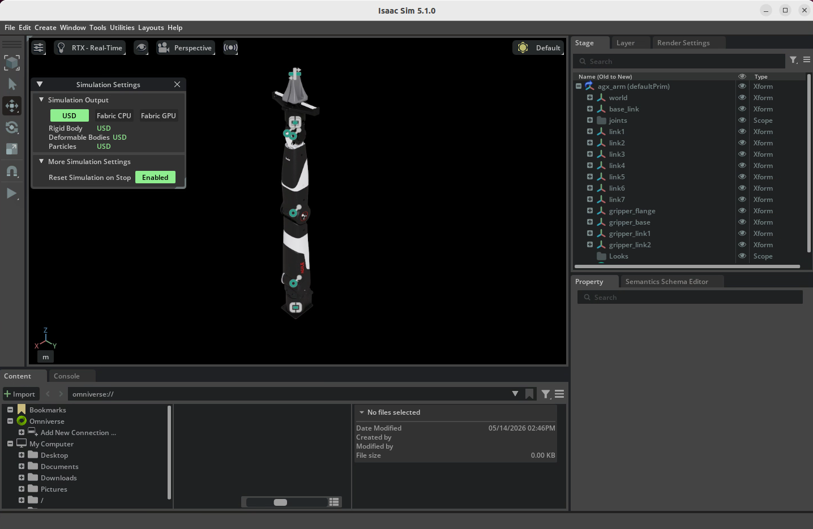

# IsaacLab数据采集--Nero机械臂键盘控制

本项目基于IsaacLab的教程，从零开始搭建，在 IsaacLab 环境中实现了 **Piper、Nero 机械臂的方块堆叠任务**，支持键盘控制完成任务、获取方块位置完成任务，可以通过遥操作进行人类演示数据的采集与回放。

## 项目仓库

https://github.com/szyzp/IsaacLab_Data_Collection.git

# 前情提要

## 环境配置


# 1、Nero 环境配置

## 1.1 配置 Nero 的 usd 文件
### 1.1.1 获取 Nero 的 URDF 文件
将source/agx_teleop/agx_description/agx_arm_urdf/nero中的nero_description.urdf、nero_with_gripper_flange_description.xacro和nero_with_gripper_description.xacro文件合并为单个 URDF 文件nero_gripper.urdf。修改合并后的nero_gripper.urdf中的meshes路径格式（原本为ros包的路径格式）。完整的 nero URDF 文件内容如下：

``` XML
<?xml version="1.0" ?>
<robot name="agx_arm">
  <link name="world"/>
  <joint name="world_to_base_link" type="fixed">
      <parent link="world"/>
      <child link="base_link"/>
      <origin rpy="0 0 3.14" xyz="0 0 0"/>
  </joint>
  <link name="base_link">
    <inertial>
      <origin rpy="0 0 0" xyz="-0.00319465997 -0.00005467608 0.04321758463"/>
      <mass value="1.06458435"/>
      <inertia ixx="0.00102659855152" ixy="0.00000186219753" ixz="-0.00000295298037" iyy="0.00114399299508" iyz="-0.00000078763492" izz="0.00090872933022"/>
    </inertial>
    <visual>
      <origin rpy="0 0 0" xyz="0 0 0"/>
      <geometry>
        <mesh filename="../meshes/dae/base_link.dae"/>
      </geometry>
    </visual>
    <collision>
      <origin rpy="0 0 0" xyz="0 0 0"/>
      <geometry>
        <mesh filename="../meshes/base_link.stl"/>
      </geometry>
    </collision>
  </link>
  <link name="link1">
    <inertial>
      <origin rpy="0 0 0" xyz="-0.00076810578 -0.00005718031 -0.00686372765"/>
      <mass value="0.76710504"/>
      <inertia ixx="0.00066689512233" ixy="0.00000273938306" ixz="0.00001463284987" iyy="0.00054501235592" iyz="0.00000183168344" izz="0.00051509465737"/>
    </inertial>
    <visual>
      <origin rpy="0 0 0" xyz="0 0 0"/>
      <geometry>
        <mesh filename="../meshes/dae/link1.dae"/>
      </geometry>
    </visual>
    <collision>
      <origin rpy="0 0 0" xyz="0 0 0"/>
      <geometry>
        <mesh filename="../meshes/link1.stl"/>
      </geometry>
    </collision>
  </link>
  <joint name="joint1" type="revolute">
    <origin rpy="0 0 0" xyz="0 0 0.138"/>
    <parent link="base_link"/>
    <child link="link1"/>
    <axis xyz="0 0 1"/>
    <limit effort="100" lower="-2.70526" upper="2.70526" velocity="5"/>
  </joint>
  <link name="link2">
    <inertial>
      <origin rpy="0 0 0" xyz="0.00079686657 -0.07890325930 0.00111849422"/>
      <mass value="0.69381908"/>
      <inertia ixx="0.00201093857656" ixy="-0.00002399426785" ixz="-0.00000072824714" iyy="0.00063544232555" iyz="0.00005831284343" izz="0.00181943989593"/>
    </inertial>
    <visual>
      <origin rpy="0 0 0" xyz="0 0 0"/>
      <geometry>
        <mesh filename="../meshes/dae/link2.dae"/>
      </geometry>
    </visual>
    <collision>
      <origin rpy="0 0 0" xyz="0 0 0"/>
      <geometry>
        <mesh filename="../meshes/link2.stl"/>
      </geometry>
    </collision>
  </link>
  <joint name="joint2" type="revolute">
    <origin rpy="1.5707963  3.1415926 0" xyz="0 0 0"/>
    <parent link="link1"/>
    <child link="link2"/>
    <axis xyz="0 0 1"/>
    <limit effort="100" lower="-1.74" upper="1.74" velocity="5"/>
  </joint>
  <link name="link3">
    <inertial>
      <origin rpy="0 0 0" xyz="0.00014513363 -0.00121378766 -0.04861136795"/>
      <mass value="0.67246544"/>
      <inertia ixx="0.00343229961910" ixy="-0.00000026976739" ixz="0.00000305078107" iyy="0.00338662526897" iyz="-0.00003550220027" izz="0.00028853579710"/>
    </inertial>
    <visual>
      <origin rpy="0 0 0" xyz="0 0 0"/>
      <geometry>
        <mesh filename="../meshes/dae/link3.dae"/>
      </geometry>
    </visual>
    <collision>
      <origin rpy="0 0 0" xyz="0 0 0"/>
      <geometry>
        <mesh filename="../meshes/link3.stl"/>
      </geometry>
    </collision>
  </link>
  <joint name="joint3" type="revolute">
    <origin rpy="-1.5707963  0 3.1415926926" xyz="0 -0.31 0"/>
    <parent link="link2"/>
    <child link="link3"/>
    <axis xyz="0 0 1"/>
    <limit effort="100" lower="-2.75" upper="2.75" velocity="5"/>
  </joint>
  <link name="link4">
    <inertial>
      <origin rpy="0 0 0" xyz="-0.00031334623 -0.05675192422 0.00076056133"/>
      <mass value="0.48451414"/>
      <inertia ixx="0.00050386693505" ixy="-0.00000529675237" ixz="0.00000006134740" iyy="0.00023502068202" iyz="0.00001815932566" izz="0.00040149523118"/>
    </inertial>
    <visual>
      <origin rpy="0 0 0" xyz="0 0 0"/>
      <geometry>
        <mesh filename="../meshes/dae/link4.dae"/>
      </geometry>
    </visual>
    <collision>
      <origin rpy="0 0 0" xyz="0 0 0"/>
      <geometry>
        <mesh filename="../meshes/link4.stl"/>
      </geometry>
    </collision>
  </link>
  <joint name="joint4" type="revolute">
    <origin rpy="-1.5707963  0 3.1415926926" xyz="0 0 0"/>
    <parent link="link3"/>
    <child link="link4"/>
    <axis xyz="0 0 1"/>
    <limit effort="100" lower="-1.01" upper="2.14" velocity="5"/>
  </joint>
  <link name="link5">
    <inertial>
      <origin rpy="0 0 0" xyz="0.00265591357 0.00201195753 -0.11620855434"/>
      <mass value="0.58368405"/>
      <inertia ixx="0.00089537686723" ixy="0.00000648218232" ixz="-0.00001463346849" iyy="0.00085866122972" iyz="-0.00004035185637" izz="0.00021774946532"/>
    </inertial>
    <visual>
      <origin rpy="0 0 0" xyz="0 0 0"/>
      <geometry>
        <mesh filename="../meshes/dae/link5.dae"/>
      </geometry>
    </visual>
    <collision>
      <origin rpy="0 0 0" xyz="0 0 0"/>
      <geometry>
        <mesh filename="../meshes/link5.stl"/>
      </geometry>
    </collision>
  </link>
  <joint name="joint5" type="revolute">
    <origin rpy="1.5707963  -1.5707963  0" xyz="0 -0.27001 0"/>
    <parent link="link4"/>
    <child link="link5"/>
    <axis xyz="0 0 1"/>
    <limit effort="100" lower="-2.75" upper="2.75" velocity="5"/>
  </joint>
  <link name="link6">
    <inertial>
      <origin rpy="0 0 0" xyz="0.00009501505 0.00107831174 -0.00019110990"/>
      <mass value="0.3140406"/>
      <inertia ixx="0.00006027211661" ixy="-0.00000024650903" ixz="0.00000015701294" iyy="0.00004699514792" iyz="0.00000004170875" izz="0.00005756771792"/>
    </inertial>
    <visual>
      <origin rpy="0 0 0" xyz="0 0 0"/>
      <geometry>
        <mesh filename="../meshes/dae/link6.dae"/>
      </geometry>
    </visual>
    <collision>
      <origin rpy="0 0 0" xyz="0 0 0"/>
      <geometry>
        <mesh filename="../meshes/link6.stl"/>
      </geometry>
    </collision>
  </link>
  <joint name="joint6" type="revolute">
    <origin rpy="1.5707963  -1.5707963  0" xyz="0 0 0"/>
    <parent link="link5"/>
    <child link="link6"/>
    <axis xyz="0 0 1"/>
    <limit effort="100" lower="-0.73" upper="0.95" velocity="5"/>
  </joint>
  <link name="link7">
    <inertial>
      <origin rpy="0 0 0" xyz="-0.00014000 -0.00010000 -0.00275000"/>
      <mass value="0.000001"/>
      <inertia ixx="1.1000000000000001e-07" ixy="0" ixz="0" iyy="1.1000000000000001e-07" iyz="0" izz="1.9999999999999999e-07"/>
    </inertial>
    <visual>
      <origin rpy="0 0 0" xyz="0 0 0"/>
      <geometry>
        <mesh filename="../meshes/dae/link7.dae"/>
      </geometry>
    </visual>
    <collision>
      <origin rpy="0 0 0" xyz="0 0 0"/>
      <geometry>
        <mesh filename="../meshes/link7.stl"/>
      </geometry>
    </collision>
  </link>
  <joint name="joint7" type="revolute">
    <origin rpy="1.5707963 0 0" xyz="0 -0.0235 0"/>
    <parent link="link6"/>
    <child link="link7"/>
    <axis xyz="0 0 1"/>
    <limit effort="100" lower="-1.5707963" upper="1.5707963" velocity="5"/>
  </joint>
  <link name="gripper_flange">
    <inertial>
      <origin rpy="0 0 0" xyz="0.0 0.0 -0.00032"/>
      <mass value="0.04771096"/>
      <inertia ixx="2.697e-05" ixy="0" ixz="0" iyy="4.311e-05" iyz="0" izz="2.479e-05"/>
    </inertial>
    <visual>
      <origin rpy="0 0 0" xyz="0 0 0"/>
      <geometry>
        <mesh filename="../meshes/dae/gripper_flange.dae"/>
      </geometry>
    </visual>
    <collision>
      <origin rpy="0 0 0" xyz="0 0 0"/>
      <geometry>
        <mesh filename="../meshes/gripper_flange.stl"/>
      </geometry>
    </collision>
  </link>
  <joint name="gripper_flange_joint" type="fixed">
    <origin rpy="-1.5708 0 -1.5708" xyz="0.032 0 -0.0235"/>
    <parent link="link7"/>
    <child link="gripper_flange"/>
  </joint>
  <link name="gripper_base">
    <inertial>
      <origin rpy="0 0 0" xyz="-0.000183807162235591 8.05033155577911E-05 0.0321436689908876"/>
      <mass value="0.45"/>
      <inertia ixx="0.00092934" ixy="0.00000034" ixz="-0.00000738" iyy="0.00071447" iyz="0.00000005" izz="0.00039442"/>
    </inertial>
    <visual>
      <origin rpy="0 0 0" xyz="0 0 0"/>
      <geometry>
        <mesh filename="../meshes/dae/gripper_base.dae"/>
      </geometry>
    </visual>
    <collision>
      <origin rpy="0 0 0" xyz="0 0 0"/>
      <geometry>
        <mesh filename="../meshes/gripper_base.stl"/>
      </geometry>
    </collision>
  </link>
  <joint name="gripper_base_joint" type="fixed">
    <origin rpy="0 0 0" xyz="0 0 0.0055"/>
    <parent link="gripper_flange"/>
    <child link="gripper_base"/>
  </joint>
  <link name="gripper_link1">
    <inertial>
      <origin rpy="0 0 0" xyz="0.00065123185041968 -0.0491929869131989 0.00972258769184025"/>
      <mass value="0.025"/>
      <inertia ixx="0.00007371" ixy="-0.00000113" ixz="0.00000021" iyy="0.00000781" iyz="-0.00001372" izz="0.0000747"/>
    </inertial>
    <visual>
      <origin rpy="0 0 0" xyz="0 0 0"/>
      <geometry>
        <mesh filename="../meshes/dae/gripper_link1.dae"/>
      </geometry>
    </visual>
    <collision>
      <origin rpy="0 0 0" xyz="0 0 0"/>
      <geometry>
        <mesh filename="../meshes/gripper_link1.stl"/>
      </geometry>
    </collision>
  </link>
  <joint name="gripper_joint1" type="prismatic">
    <origin rpy="1.5707963 0 3.1415926" xyz="0 0 0.1358"/>
    <parent link="gripper_base"/>
    <child link="gripper_link1"/>
    <axis xyz="0 0 1"/>
    <limit effort="10" lower="0" upper="0.05" velocity="3"/>
  </joint>
  <link name="gripper_link2">
    <inertial>
      <origin rpy="0 0 0" xyz="0.00065123185041968 -0.0491929869131989 0.00972258769184025"/>
      <mass value="0.025"/>
      <inertia ixx="0.00007371" ixy="-0.00000113" ixz="0.00000021" iyy="0.00000781" iyz="-0.00001372" izz="0.0000747"/>
    </inertial>
    <visual>
      <origin rpy="0 0 0" xyz="0 0 0"/>
      <geometry>
        <mesh filename="../meshes/dae/gripper_link2.dae"/>
      </geometry>
    </visual>
    <collision>
      <origin rpy="0 0 0" xyz="0 0 0"/>
      <geometry>
        <mesh filename="../meshes/gripper_link2.stl"/>
      </geometry>
    </collision>
  </link>
  <joint name="gripper_joint2" type="prismatic">
    <origin rpy="1.5707963 0 0" xyz="0 0 0.1358"/>
    <parent link="gripper_base"/>
    <child link="gripper_link2"/>
    <axis xyz="0 0 -1"/>
    <limit effort="10" lower="-0.05" upper="0" velocity="3"/>
  </joint>
</robot>
```

### 1.1.2 获取 Nero 的 USD 文件
转换 Nero 的 URDF 文件为 USD 文件
使用 isaaclab 自带的转换脚本 scripts/tools/convert_urdf.py，命令如下：

``` bash
python ../IsaacLab/scripts/tools/convert_urdf.py \
  /home/agilex/isaac-cosmos/agx_teleop/source/agx_teleop/agx_description/agx_arm_urdf/nero/urdf/nero_gripper.urdf \
  /home/agilex/isaac-cosmos/agx_teleop/source/agx_teleop/agx_description/agx_arm_urdf/nero/usd/nero.usd \
  --fix-base 
```


### 1.1.3 nero 配置文件
创建 assets/nero.py 文件，内容如下：
``` python
import isaaclab.sim as sim_utils
from isaaclab.actuators import ImplicitActuatorCfg
from isaaclab.assets.articulation import ArticulationCfg

from agx_teleop.assets import AGX_TELEOP_DESCRIPTION_DIR

##
# Configuration
##

NERO_GRIPPER_CFG = ArticulationCfg(
    spawn=sim_utils.UsdFileCfg(
        usd_path=f"{AGX_TELEOP_DESCRIPTION_DIR}/agx_arm_urdf/nero/usd/nero.usd",
        rigid_props=sim_utils.RigidBodyPropertiesCfg(
            disable_gravity=False,
            max_depenetration_velocity=5.0,
        ),
        articulation_props=sim_utils.ArticulationRootPropertiesCfg(
            enabled_self_collisions=False, solver_position_iteration_count=8, solver_velocity_iteration_count=0
        ),
    ),
    init_state=ArticulationCfg.InitialStateCfg(
        rot=(1.0, 0.0, 0.0, 0.0),
        joint_pos={
            "joint1": 0.0,
            "joint2": 0.0,
            "joint3": 0.0,
            "joint4": 1.22,
            "joint5": 0.0,
            "joint6": 0.0,
            "joint7": 1.31,
            "gripper_joint1": 0.05,
            "gripper_joint2": -0.05
        },
        # Set initial joint velocities to zero
        joint_vel={".*": 0.0},
    ),
    actuators={
        "arm": ImplicitActuatorCfg(
            joint_names_expr=["joint.*"],
            effort_limit=25.0, # 稍微限制出力，防止瞬间冲击
            velocity_limit=1.5,
            
            # 刚度 (Stiffness)
            stiffness={
                "joint1": 200.0, 
                "joint2": 170.0,
                "joint3": 120.0,
                "joint4": 80.0,
                "joint5": 50.0,
                "joint6": 20.0,
                "joint7": 10.0
            },
            
            # 阻尼 (Damping)：采用临界阻尼思路，比例设在 10% 左右
            damping={
                "joint1": 100.0,
                "joint2": 60.0,
                "joint3": 70.0,
                "joint4": 24.0,
                "joint5": 20.0,
                "joint6": 10.0,
                "joint7": 5,
            },
        ),
        "gripper": ImplicitActuatorCfg(
            joint_names_expr=["gripper_joint1","gripper_joint2"],
            effort_limit_sim=22,
            velocity_limit_sim=1.5,
            stiffness=800.0,
            damping=20.0,
        ),
    },
    soft_joint_pos_limit_factor=0.9,
)

NERO_GRIPPER_HIGH_PD_CFG = NERO_GRIPPER_CFG.copy()
NERO_GRIPPER_HIGH_PD_CFG.spawn.rigid_props.disable_gravity = True
```


# 2、任务环境配置
## 2.1 配置项目结构
> 参考isaaclab官方代码进行修改：isaaclab/source/isaaclab_tasks/isaaclab_tasks/manager_based/manipulation/stack
``` bash
cd agx_teleop
mkdir -p source/agx_teleop/agx_teleop/tasks/manager_based/manipulation/stack/config/nero/agents/robomimic
```

创建以下文件：
```
manipulation/stack/config/nero/__init__.py
manipulation/stack/config/nero/agents/__init__.py
manipulation/stack/config/nero/agents/robomimic/bc_rnn_low_dim.json
manipulation/stack/config/nero/nero_stack_ik_rel_env_cfg.py
manipulation/stack/config/nero/nero_stack_joint_pos_env_cfg.py
```
创建命令：
``` bash
cd source/agx_teleop/agx_teleop/tasks/manager_based/

touch   manipulation/stack/config/nero/__init__.py \
        manipulation/stack/config/nero/agents/__init__.py \
        manipulation/stack/config/nero/agents/robomimic/bc_rnn_low_dim.json \
        manipulation/stack/config/nero/nero_stack_ik_rel_env_cfg.py \
        manipulation/stack/config/nero/nero_stack_joint_pos_env_cfg.py
```

## 2.2 修改文件
### 2.2.1 stack/config/nero/agents/robomimic/bc_rnn_low_dim.json
复制isaaclab对应代码，无需修改。  
bc_rnn_low_dim.json:

``` json
{
    "algo_name": "bc",
    "experiment": {
        "name": "bc_rnn_low_dim_franka_stack",
        "validate": false,
        "logging": {
            "terminal_output_to_txt": true,
            "log_tb": true
        },
        "save": {
            "enabled": true,
            "every_n_seconds": null,
            "every_n_epochs": 100,
            "epochs": [],
            "on_best_validation": false,
            "on_best_rollout_return": false,
            "on_best_rollout_success_rate": true
        },
        "epoch_every_n_steps": 100,
        "env": null,
        "additional_envs": null,
        "render": false,
        "render_video": false,
        "rollout": {
            "enabled": false
        }
    },
    "train": {
        "data": null,
        "num_data_workers": 4,
        "hdf5_cache_mode": "all",
        "hdf5_use_swmr": true,
        "hdf5_normalize_obs": false,
        "hdf5_filter_key": null,
        "hdf5_validation_filter_key": null,
        "seq_length": 10,
        "dataset_keys": [
            "actions"
        ],
        "goal_mode": null,
        "cuda": true,
        "batch_size": 100,
        "num_epochs": 2000,
        "seed": 101
    },
    "algo": {
        "optim_params": {
            "policy": {
                "optimizer_type": "adam",
                "learning_rate": {
                    "initial": 0.001,
                    "decay_factor": 0.1,
                    "epoch_schedule": [],
                    "scheduler_type": "multistep"
                },
                "regularization": {
                    "L2": 0.0
                }
            }
        },
        "loss": {
            "l2_weight": 1.0,
            "l1_weight": 0.0,
            "cos_weight": 0.0
        },
        "actor_layer_dims": [],
        "gmm": {
            "enabled": true,
            "num_modes": 5,
            "min_std": 0.0001,
            "std_activation": "softplus",
            "low_noise_eval": true
        },
        "rnn": {
            "enabled": true,
            "horizon": 10,
            "hidden_dim": 400,
            "rnn_type": "LSTM",
            "num_layers": 2,
            "open_loop": false,
            "kwargs": {
                "bidirectional": false
            }
        }
    },
    "observation": {
        "modalities": {
            "obs": {
                "low_dim": [
                    "eef_pos",
                    "eef_quat",
                    "gripper_pos",
                    "object"
                ],
                "rgb": [],
                "depth": [],
                "scan": []
            }
        }
    }
}
```

### 2.2.2 stack/config/nero/nero_stack_joint_pos_env_cfg.py
复制isaaclab对应代码，修改如下内容：
  - 修改stack相关和nero配置的导入。
  - 修改类、函数和变量的名称。
  - 修改 nero 机械臂的默认位姿。
  - 修改夹爪部分。
  - 修改 ee_frame 设置部分。  

完整代码 nero_stack_joint_pos_env_cfg.py：
``` python
# Copyright (c) 2022-2026, The Isaac Lab Project Developers (https://github.com/isaac-sim/IsaacLab/blob/main/CONTRIBUTORS.md).
# All rights reserved.
#
# SPDX-License-Identifier: BSD-3-Clause

from isaaclab.assets import RigidObjectCfg
from isaaclab.managers import EventTermCfg as EventTerm
from isaaclab.managers import SceneEntityCfg
from isaaclab.sensors import FrameTransformerCfg
from isaaclab.sensors.frame_transformer.frame_transformer_cfg import OffsetCfg
from isaaclab.sim.schemas.schemas_cfg import RigidBodyPropertiesCfg
from isaaclab.sim.spawners.from_files.from_files_cfg import UsdFileCfg
from isaaclab.utils import configclass
from isaaclab.utils.assets import ISAAC_NUCLEUS_DIR

from agx_teleop.tasks.manager_based.manipulation.stack import mdp
from agx_teleop.tasks.manager_based.manipulation.stack.mdp import piper_stack_events
from agx_teleop.tasks.manager_based.manipulation.stack.stack_env_cfg import StackEnvCfg

##
# Pre-defined configs
##
from isaaclab.markers.config import FRAME_MARKER_CFG  # isort: skip
from agx_teleop.assets.nero import NERO_GRIPPER_CFG  # isort: skip


@configclass
class EventCfg:
    """Configuration for events."""

    init_nero_arm_pose = EventTerm(
        func=piper_stack_events.set_default_joint_pose,
        mode="reset",
        params={
            "default_pose": [0.0, 0.0, 0.0, 1.22, 0.0, 0.0, 1.31, 0.05, -0.05],   # 7机械臂+2夹爪，夹爪打开
        },
    )

    randomize_nero_joint_state = EventTerm(
        func=piper_stack_events.randomize_joint_by_gaussian_offset,
        mode="reset",
        params={
            "mean": 0.0,
            "std": 0.02,
            "asset_cfg": SceneEntityCfg("robot"),
        },
    )

    randomize_cube_positions = EventTerm(
        func=piper_stack_events.randomize_object_pose,
        mode="reset",
        params={
            "pose_range": {"x": (0.3, 0.5), "y": (-0.10, 0.10), "z": (0.0203, 0.0203), "yaw": (-1.0, 1, 0)},
            "min_separation": 0.12,
            "asset_cfgs": [SceneEntityCfg("cube_1"), SceneEntityCfg("cube_2"), SceneEntityCfg("cube_3")],
        },
    )


@configclass
class NeroCubeStackEnvCfg(StackEnvCfg):
    """Configuration for the Nero Cube Stack Environment."""

    def __post_init__(self):
        # post init of parent
        super().__post_init__()

        # Set events
        self.events = EventCfg()

        # Set Nero as robot
        self.scene.robot = NERO_GRIPPER_CFG.replace(prim_path="{ENV_REGEX_NS}/Robot")
        self.scene.robot.spawn.semantic_tags = [("class", "robot")]

        # Add semantics to table
        self.scene.table.spawn.semantic_tags = [("class", "table")]

        # Add semantics to ground
        self.scene.plane.semantic_tags = [("class", "ground")]

        # Set actions for the specific robot type (nero)
        self.actions.arm_action = mdp.JointPositionActionCfg(
            asset_name="robot", joint_names=["joint.*"], scale=0.5, use_default_offset=True
        )
        self.actions.gripper_action = mdp.BinaryJointPositionActionCfg(
            asset_name="robot",
            joint_names=["gripper_joint.*"],
            open_command_expr={
                "gripper_joint1": 0.05,
                "gripper_joint2": -0.05,    
            },
            close_command_expr={
                "gripper_joint1": 0.0,
                "gripper_joint2": 0.0,
            },
        )
        # utilities for gripper status check
        self.gripper_joint_names = ["gripper_joint.*"]
        self.gripper_open_val = [0.05, -0.05]
        self.gripper_threshold = 0.005

        # Rigid body properties of each cube
        cube_properties = RigidBodyPropertiesCfg(
            solver_position_iteration_count=16,
            solver_velocity_iteration_count=1,
            max_angular_velocity=1000.0,
            max_linear_velocity=1000.0,
            max_depenetration_velocity=5.0,
            disable_gravity=False,
        )

        # Set each stacking cube deterministically
        self.scene.cube_1 = RigidObjectCfg(
            prim_path="{ENV_REGEX_NS}/Cube_1",
            init_state=RigidObjectCfg.InitialStateCfg(pos=[0.4, 0.0, 0.0203], rot=[1, 0, 0, 0]),
            spawn=UsdFileCfg(
                usd_path=f"{ISAAC_NUCLEUS_DIR}/Props/Blocks/blue_block.usd",
                scale=(1.0, 1.0, 1.0),
                rigid_props=cube_properties,
                semantic_tags=[("class", "cube_1")],
            ),
        )
        self.scene.cube_2 = RigidObjectCfg(
            prim_path="{ENV_REGEX_NS}/Cube_2",
            init_state=RigidObjectCfg.InitialStateCfg(pos=[0.55, 0.05, 0.0203], rot=[1, 0, 0, 0]),
            spawn=UsdFileCfg(
                usd_path=f"{ISAAC_NUCLEUS_DIR}/Props/Blocks/red_block.usd",
                scale=(1.0, 1.0, 1.0),
                rigid_props=cube_properties,
                semantic_tags=[("class", "cube_2")],
            ),
        )
        self.scene.cube_3 = RigidObjectCfg(
            prim_path="{ENV_REGEX_NS}/Cube_3",
            init_state=RigidObjectCfg.InitialStateCfg(pos=[0.60, -0.1, 0.0203], rot=[1, 0, 0, 0]),
            spawn=UsdFileCfg(
                usd_path=f"{ISAAC_NUCLEUS_DIR}/Props/Blocks/green_block.usd",
                scale=(1.0, 1.0, 1.0),
                rigid_props=cube_properties,
                semantic_tags=[("class", "cube_3")],
            ),
        )

        # Listens to the required transforms
        marker_cfg = FRAME_MARKER_CFG.copy()
        marker_cfg.markers["frame"].scale = (0.1, 0.1, 0.1)
        marker_cfg.prim_path = "/Visuals/FrameTransformer"
        self.scene.ee_frame = FrameTransformerCfg(
            prim_path="{ENV_REGEX_NS}/Robot/world",
            debug_vis=False,
            visualizer_cfg=marker_cfg,
            target_frames=[
                FrameTransformerCfg.FrameCfg(
                    prim_path="{ENV_REGEX_NS}/Robot/gripper_base",
                    name="end_effector",
                    offset=OffsetCfg(
                        pos=[0.0, 0.0, 0.125],
                    ),
                ),
                FrameTransformerCfg.FrameCfg(
                    prim_path="{ENV_REGEX_NS}/Robot/gripper_link1",
                    name="tool_rightfinger",
                    offset=OffsetCfg(
                        pos=(0.0, 0.0, 0.0),
                    ),
                ),
                FrameTransformerCfg.FrameCfg(
                    prim_path="{ENV_REGEX_NS}/Robot/gripper_link2",
                    name="tool_leftfinger",
                    offset=OffsetCfg(
                        pos=(0.0, 0.0, 0.0),
                    ),
                ),
            ],
        )
```

### 2.2.3 stack/config/nero/nero_stack_ik_rel_env_cfg.py
复制isaaclab对应代码，修改如下内容：
  - 修改导入和命名
  - 修改末端执行器的偏移量  

完整代码 nero_stack_ik_rel_env_cfg.py：
``` python
# Copyright (c) 2022-2026, The Isaac Lab Project Developers (https://github.com/isaac-sim/IsaacLab/blob/main/CONTRIBUTORS.md).
# All rights reserved.
#
# SPDX-License-Identifier: BSD-3-Clause

from isaaclab.controllers.differential_ik_cfg import DifferentialIKControllerCfg
from isaaclab.devices.device_base import DeviceBase, DevicesCfg
from isaaclab.devices.keyboard import Se3KeyboardCfg
from isaaclab.devices.openxr.openxr_device import OpenXRDeviceCfg
from isaaclab.devices.openxr.retargeters.manipulator.gripper_retargeter import GripperRetargeterCfg
from isaaclab.devices.openxr.retargeters.manipulator.se3_rel_retargeter import Se3RelRetargeterCfg
from isaaclab.envs.mdp.actions.actions_cfg import DifferentialInverseKinematicsActionCfg
from isaaclab.managers import SceneEntityCfg
from isaaclab.managers import TerminationTermCfg as DoneTerm
from isaaclab.utils import configclass

from agx_teleop.tasks.manager_based.manipulation.stack.stack_env_cfg import mdp

from . import nero_stack_joint_pos_env_cfg

##
# Pre-defined configs
##
from agx_teleop.assets.nero import NERO_GRIPPER_HIGH_PD_CFG  # isort: skip


@configclass
class NeroCubeStackEnvCfg(nero_stack_joint_pos_env_cfg.NeroCubeStackEnvCfg):
    def __post_init__(self):
        # post init of parent
        super().__post_init__()

        # Set Nero as robot
        # We switch here to a stiffer PD controller for IK tracking to be better.
        self.scene.robot = NERO_GRIPPER_HIGH_PD_CFG.replace(prim_path="{ENV_REGEX_NS}/Robot")

        # Set actions for the specific robot type (nero)
        self.actions.arm_action = DifferentialInverseKinematicsActionCfg(
            asset_name="robot",
            joint_names=["joint.*"],
            body_name="gripper_base",
            controller=DifferentialIKControllerCfg(command_type="pose", use_relative_mode=True, ik_method="dls"),
            scale=0.5,
            body_offset=DifferentialInverseKinematicsActionCfg.OffsetCfg(pos=[0.0, 0.0, 0.125]),
        )

        self.teleop_devices = DevicesCfg(
            devices={
                "handtracking": OpenXRDeviceCfg(
                    retargeters=[
                        Se3RelRetargeterCfg(
                            bound_hand=DeviceBase.TrackingTarget.HAND_RIGHT,
                            zero_out_xy_rotation=True,
                            use_wrist_rotation=False,
                            use_wrist_position=True,
                            delta_pos_scale_factor=10.0,
                            delta_rot_scale_factor=10.0,
                            sim_device=self.sim.device,
                        ),
                        GripperRetargeterCfg(
                            bound_hand=DeviceBase.TrackingTarget.HAND_RIGHT, sim_device=self.sim.device
                        ),
                    ],
                    sim_device=self.sim.device,
                    xr_cfg=self.xr,
                ),
                "keyboard": Se3KeyboardCfg(
                    pos_sensitivity=0.05,
                    rot_sensitivity=0.05,
                    sim_device=self.sim.device,
                ),
            }
        )


@configclass
class NeroCubeStackRedGreenEnvCfg(NeroCubeStackEnvCfg):
    def __post_init__(self):
        # post init of parent
        super().__post_init__()

        self.terminations.success = DoneTerm(
            func=mdp.cubes_stacked,
            params={"cube_1_cfg": SceneEntityCfg("cube_2"), "cube_2_cfg": SceneEntityCfg("cube_3"), "cube_3_cfg": None},
        )


@configclass
class NeroCubeStackRedGreenBlueEnvCfg(NeroCubeStackEnvCfg):
    def __post_init__(self):
        # post init of parent
        super().__post_init__()

        self.terminations.success = DoneTerm(
            func=mdp.cubes_stacked,
            params={
                "cube_1_cfg": SceneEntityCfg("cube_2"),
                "cube_2_cfg": SceneEntityCfg("cube_3"),
                "cube_3_cfg": SceneEntityCfg("cube_1"),
            },
        )


@configclass
class NeroCubeStackBlueGreenEnvCfg(NeroCubeStackEnvCfg):
    def __post_init__(self):
        # post init of parent
        super().__post_init__()

        self.terminations.success = DoneTerm(
            func=mdp.cubes_stacked,
            params={"cube_1_cfg": SceneEntityCfg("cube_1"), "cube_2_cfg": SceneEntityCfg("cube_3"), "cube_3_cfg": None},
        )


@configclass
class NeroCubeStackBlueGreenRedEnvCfg(NeroCubeStackEnvCfg):
    def __post_init__(self):
        # post init of parent
        super().__post_init__()

        self.terminations.success = DoneTerm(
            func=mdp.cubes_stacked,
            params={
                "cube_1_cfg": SceneEntityCfg("cube_1"),
                "cube_2_cfg": SceneEntityCfg("cube_3"),
                "cube_3_cfg": SceneEntityCfg("cube_2"),
            },
        )
```

### 2.2.4 stack/config/nero/\__init__.py
``` python
# Copyright (c) 2022-2026, The Isaac Lab Project Developers (https://github.com/isaac-sim/IsaacLab/blob/main/CONTRIBUTORS.md).
# All rights reserved.
#
# SPDX-License-Identifier: BSD-3-Clause
import gymnasium as gym

# from isaaclab_tasks.manager_based.manipulation.stack.config.franka import agents
from agx_teleop.tasks.manager_based.manipulation.stack.config.nero import agents

##
# Register Gym environments.
##

gym.register(
    id="Isaac-Stack-Cube-Nero-IK-Rel-v0",
    entry_point="isaaclab.envs:ManagerBasedRLEnv",
    kwargs={
        "env_cfg_entry_point": f"{__name__}.nero_stack_ik_rel_env_cfg:NeroCubeStackEnvCfg",
        "robomimic_bc_cfg_entry_point": f"{agents.__name__}:robomimic/bc_rnn_low_dim.json",
    },
    disable_env_checker=True,
)
```


# 3、遥操作收集数据
``` bash
# 首先创建数据集文件夹
mkdir -p datasets

# 遥操作收集数据命令，此处为键盘遥操作，可选设备：spacemouse, keyboard, handtracking
python scripts/tools/record_demos.py \
    --task Isaac-Stack-Cube-Nero-IK-Rel-v0 \
    --device cpu --teleop_device keyboard \
    --dataset_file ./datasets/nero_dataset.hdf5 \
    --num_demos 10

# 回放收集的数据
python scripts/tools/replay_demos.py \
    --task Isaac-Stack-Cube-Nero-IK-Rel-v0 \
    --device cpu --dataset_file ./datasets/nero_dataset.hdf5
```
keyboard遥操作方法：
```
Keyboard Controller for SE(3): Se3Keyboard
   Reset all commands: R
   Toggle gripper (open/close): K
   Move arm along x-axis: W/S
   Move arm along y-axis: A/D
   Move arm along z-axis: Q/E
   Rotate arm along x-axis: Z/X
   Rotate arm along y-axis: T/G
   Rotate arm along z-axis: C/V
```

