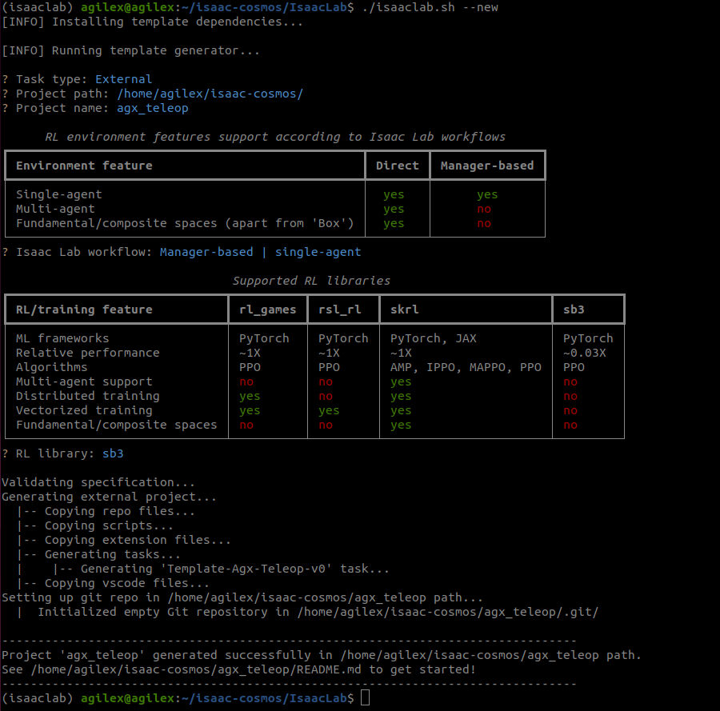
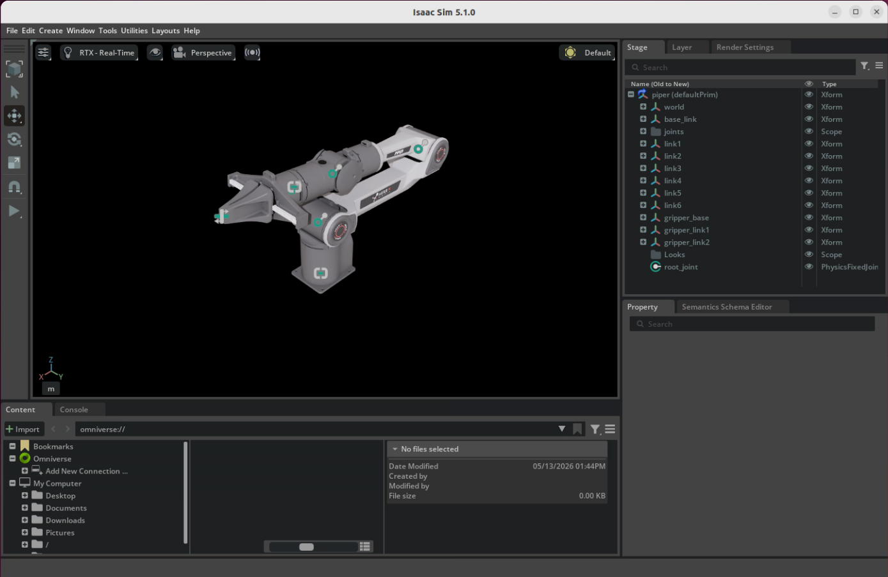

# IsaacLab数据采集--Piper机械臂键盘控制

本项目基于IsaacLab的教程，从零开始搭建，在 IsaacLab 环境中实现了 **Piper、Nero 机械臂的方块堆叠任务**，支持键盘控制完成任务、识别获取方块位置完成任务，可以通过遥操作进行人类演示数据的采集与回放。

## 项目仓库

https://github.com/szyzp/IsaacLab_Data_Collection.git

# 1、项目配置

## 1.1 创建 isaaclab 外部项目
### 1.1.1 创建命令
在 isaaclab 源码路径下执行：
> 需先安装 isaaclab，并且创建好 conda 虚拟环境 isaaclab
``` bash
conda activate isaaclab
./isaaclab.sh --new
```
### 1.1.2 创建步骤
1. 选择外部项目：`External`
2. 输入项目路径：`/home/agilex/isaac-cosmos/`
3. 输入项目名称：`agx_teleop`
4. 选择工作流：`Manager-based | single-agent`
5. 选择RL库：根据个人需求选择
6. 选择RL算法：根据个人需求选择

agx_teleop 初始项目结构：
```
├── pyproject.toml
├── README.md
├── scripts
│   ├── list_envs.py
│   ├── random_agent.py
│   ├── sb3
│   │   ├── play.py
│   │   └── train.py
│   └── zero_agent.py
└── source
    └── agx_teleop
        ├── agx_teleop
        │   ├── __init__.py
        │   ├── tasks
        │   │   ├── __init__.py
        │   │   └── manager_based
        │   │       ├── agx_teleop
        │   │       │   ├── agents
        │   │       │   │   ├── __init__.py
        │   │       │   │   └── sb3_ppo_cfg.yaml
        │   │       │   ├── agx_teleop_env_cfg.py
        │   │       │   ├── __init__.py
        │   │       │   └── mdp
        │   │       │       ├── __init__.py
        │   │       │       └── rewards.py
        │   │       └── __init__.py
        │   └── ui_extension_example.py
        ├── agx_teleop.egg-info
        │   ├── dependency_links.txt
        │   ├── not-zip-safe
        │   ├── PKG-INFO
        │   ├── requires.txt
        │   ├── SOURCES.txt
        │   └── top_level.txt
        ├── config
        │   └── extension.toml
        ├── docs
        │   └── CHANGELOG.rst
        ├── pyproject.toml
        └── setup.py
```
### 1.1.3 安装外部项目
执行以下命令：
``` bash
cd ../agx_teleop
python -m pip install -e source/agx_teleop
```

## 1.2 配置 piper 的 usd 文件
### 1.2.1 获取 piper 的 URDF 文件
1. 获取URDF文件
``` bash
cd agx_teleop
mkdir -p source/agx_teleop/agx_description
cd source/agx_teleop/agx_description
git clone https://github.com/agilexrobotics/agx_arm_urdf.git
```
2. 将仓库中的piper_with_gripper_description.xacro和piper_description.urdf文件合并为单个 URDF 文件piper_gripper.urdf。修改合并后的piper_gripper.urdf中的meshes路径格式（原本为ros包的路径格式），修改方法如下：

```XML
    <link name="base_link">
        <inertial>
            <origin xyz="-0.00473641164191482 2.56829134630247E-05 0.041451518036016" rpy="0 0 0"/>
            <mass value="1.02" />
            <inertia ixx="0.00267433" ixy="-0.00000073" ixz="-0.00017389" iyy="0.00282612" iyz="0.0000004" izz="0.00089624"/>
        </inertial>
        <visual>
            <origin xyz="0 0 0" rpy="0 0 0"/>
            <geometry>
                <mesh filename="../meshes/dae/base_link.dae"/>
            </geometry>
        </visual>
        <collision>
            <origin xyz="0 0 0" rpy="0 0 0"/>
            <geometry>
                <mesh filename="../meshes/base_link.stl"/>
            </geometry>
        </collision>
    </link>
```

3. 完整的 [piper URDF 文件](https://github.com/szyzp/IsaacLab_Data_Collection/blob/main/source/agx_teleop/agx_description/agx_arm_urdf/piper/urdf/piper_gripper.urdf)


### 1.2.2 获取 piper 的 USD 文件

1. 转换 piper 的 URDF 文件为 USD 文件
    使用 isaaclab 自带的转换脚本 scripts/tools/convert_urdf.py，命令如下：
``` bash
python ../IsaacLab/scripts/tools/convert_urdf.py \
/home/agilex/isaac-cosmos/agx_teleop/source/agx_teleop/agx_description/agx_arm_urdf/piper/urdf/piper_gripper.urdf \
/home/agilex/isaac-cosmos/agx_teleop/source/agx_teleop/agx_description/agx_arm_urdf/piper/usd/piper.usd \
--fix-base 
```

### 1.2.3 piper 配置文件
``` bash
cd agx_teleop
mkdir -p source/agx_teleop/agx_teleop/assets
```
1. 创建 assets/__init__.py 文件，内容如下：
``` python
"""Package containing robot configurations."""
import os
import toml

##
# Configuration for different assets.
##

# Conveniences to other module directories via relative paths
AGX_TELEOP_EXT_DIR = os.path.abspath(os.path.join(os.path.dirname(__file__), "../../"))
"""Path to the source agx_teleop directory."""

AGX_TELEOP_DESCRIPTION_DIR = os.path.join(AGX_TELEOP_EXT_DIR, "agx_description")
"""Path to the agx_description directory."""
```
2. 创建 assets/piper.py 文件，内容如下：
``` python
import isaaclab.sim as sim_utils
from isaaclab.actuators import ImplicitActuatorCfg
from isaaclab.assets.articulation import ArticulationCfg

from agx_teleop.assets import AGX_TELEOP_DESCRIPTION_DIR

PIPER_GRIPPER_CFG = ArticulationCfg(
    spawn=sim_utils.UsdFileCfg(
        usd_path=f"{AGX_TELEOP_DESCRIPTION_DIR}/agx_arm_urdf/piper/usd/piper.usd",
        rigid_props=sim_utils.RigidBodyPropertiesCfg(
            disable_gravity=False,
            max_depenetration_velocity=5.0,
        ),
        articulation_props=sim_utils.ArticulationRootPropertiesCfg(
            enabled_self_collisions=True, solver_position_iteration_count=8, solver_velocity_iteration_count=0
        ),
    ),
    init_state=ArticulationCfg.InitialStateCfg(
        joint_pos={
            "joint1": 0.0,  
            "joint2": 1.57,
            "joint3": -1.57,
            "joint4": 0.0,  
            "joint5": 1.22,
            "joint6": 0.0,
            "gripper_joint1": 0.0,
            "gripper_joint2": 0.0,
        },
        pos=(0.0, 0.0, 0.0)
    ),
    actuators={
        "piper_shoulder": ImplicitActuatorCfg(
            joint_names_expr=["joint[1-3]"],
            effort_limit_sim=100.0,
            velocity_limit_sim=5.0,
            stiffness=80.0,
            damping=20.0,
        ),
        "piper_forearm": ImplicitActuatorCfg(
            joint_names_expr=["joint[4-6]"],
            effort_limit_sim=100.0,
            velocity_limit_sim=5.0,
            stiffness=40.0,
            damping=10.0,
        ),
        "gripper": ImplicitActuatorCfg(     # 参考 https://github.com/smalleha/isaac_so_arm101/blob/main/src/isaac_so_arm101/robots/piper_description/piper.py
            joint_names_expr=["gripper_joint1","gripper_joint2"],
            effort_limit_sim=22,  # Increased from 1.9 to 2.5 for stronger grip
            velocity_limit_sim=1.5,
            stiffness=800.0,  # Increased from 25.0 to 60.0 for more reliable closing
            damping=20.0,  # Increased from 10.0 to 20.0 for stability
        ),
    },
    soft_joint_pos_limit_factor=0.9,
)
"""Configuration for the Piper robot with parallel gripper."""

PIPER_GRIPPER_HIGH_PD_CFG = PIPER_GRIPPER_CFG.copy()
PIPER_GRIPPER_HIGH_PD_CFG.spawn.rigid_props.disable_gravity = True
PIPER_GRIPPER_HIGH_PD_CFG.actuators["piper_shoulder"].stiffness = 400.0
PIPER_GRIPPER_HIGH_PD_CFG.actuators["piper_shoulder"].damping = 80.0
PIPER_GRIPPER_HIGH_PD_CFG.actuators["piper_forearm"].stiffness = 200.0
PIPER_GRIPPER_HIGH_PD_CFG.actuators["piper_forearm"].damping = 40.0
PIPER_GRIPPER_HIGH_PD_CFG.actuators["gripper"].velocity_limit_sim = 0.5
"""Configuration of Piper with gripper robot with stiffer PD control.

This configuration is useful for task-space control using differential IK.
"""
```


# 2、任务环境配置
## 2.1 配置项目结构
> 参考isaaclab官方代码进行修改：isaaclab/source/isaaclab_tasks/isaaclab_tasks/manager_based/manipulation/stack
``` bash
cd agx_teleop
mkdir -p source/agx_teleop/agx_teleop/tasks/manager_based/manipulation/stack/config/piper/agents/robomimic
mkdir -p source/agx_teleop/agx_teleop/tasks/manager_based/manipulation/stack/mdp
```
创建命令：
``` bash
cd source/agx_teleop/agx_teleop/tasks/manager_based/

touch manipulation/__init__.py \
      manipulation/stack/__init__.py \
      manipulation/stack/stack_env_cfg.py \
      manipulation/stack/mdp/__init__.py \
      manipulation/stack/mdp/observations.py \
      manipulation/stack/mdp/piper_stack_events.py \
      manipulation/stack/mdp/terminations.py \
      manipulation/stack/config/__init__.py \
      manipulation/stack/config/piper/__init__.py \
      manipulation/stack/config/piper/agents/__init__.py \
      manipulation/stack/config/piper/agents/robomimic/bc_rnn_low_dim.json \
      manipulation/stack/config/piper/piper_stack_ik_rel_env_cfg.py \
      manipulation/stack/config/piper/piper_stack_joint_pos_env_cfg.py
```
## 2.2 修改文件
### 2.2.1 stack/stack_env_cfg.py 和 stack/mdp/__init__.py 和 stack/config/piper/agents/robomimic/bc_rnn_low_dim.json
复制isaaclab对应代码到项目中，无需修改

```
/Isaac/IsaacLab/source/isaaclab_tasks/isaaclab_tasks/manager_based/manipulation/stack/stack_env_cfg.py

/Isaac/IsaacLab/source/isaaclab_tasks/isaaclab_tasks/manager_based/manipulation/stack/__init__.py

/IsaacLab/source/isaaclab_tasks/isaaclab_tasks/manager_based/manipulation/stack/config/franka/agents/robomimic/bc_rnn_low_dim.json
```

### 2.2.2 stack/mdp/piper_stack_events.py
复制isaaclab对应代码到项目中，无需修改

```
Isaac/IsaacLab/source/isaaclab_tasks/isaaclab_tasks/manager_based/manipulation/stack/mdp/franka_stack_events.py
```

### 2.2.3 stack/mdp/observations.py
复制isaaclab对应代码，修改其中gripper_open_val相关的部分。Franka panda 夹爪控制是一个关节值，piper 夹爪控制是两个关节值，需调整以匹配 piper 的夹爪。\
下面是完整代码，相关修改在Lines 320-343和Lines 380-407。

``` python
# Copyright (c) 2022-2026, The Isaac Lab Project Developers (https://github.com/isaac-sim/IsaacLab/blob/main/CONTRIBUTORS.md).
# All rights reserved.
#
# SPDX-License-Identifier: BSD-3-Clause

from __future__ import annotations

from typing import TYPE_CHECKING, Literal

import torch

import isaaclab.utils.math as math_utils
from isaaclab.assets import Articulation, RigidObject, RigidObjectCollection
from isaaclab.managers import SceneEntityCfg
from isaaclab.sensors import FrameTransformer

if TYPE_CHECKING:
    from isaaclab.envs import ManagerBasedRLEnv

def cube_positions_in_world_frame(
    env: ManagerBasedRLEnv,
    cube_1_cfg: SceneEntityCfg = SceneEntityCfg("cube_1"),
    cube_2_cfg: SceneEntityCfg = SceneEntityCfg("cube_2"),
    cube_3_cfg: SceneEntityCfg = SceneEntityCfg("cube_3"),
) -> torch.Tensor:
    """The position of the cubes in the world frame."""
    cube_1: RigidObject = env.scene[cube_1_cfg.name]
    cube_2: RigidObject = env.scene[cube_2_cfg.name]
    cube_3: RigidObject = env.scene[cube_3_cfg.name]

    return torch.cat((cube_1.data.root_pos_w, cube_2.data.root_pos_w, cube_3.data.root_pos_w), dim=1)

def instance_randomize_cube_positions_in_world_frame(
    env: ManagerBasedRLEnv,
    cube_1_cfg: SceneEntityCfg = SceneEntityCfg("cube_1"),
    cube_2_cfg: SceneEntityCfg = SceneEntityCfg("cube_2"),
    cube_3_cfg: SceneEntityCfg = SceneEntityCfg("cube_3"),
) -> torch.Tensor:
    """The position of the cubes in the world frame."""
    if not hasattr(env, "rigid_objects_in_focus"):
        return torch.full((env.num_envs, 9), fill_value=-1)

    cube_1: RigidObjectCollection = env.scene[cube_1_cfg.name]
    cube_2: RigidObjectCollection = env.scene[cube_2_cfg.name]
    cube_3: RigidObjectCollection = env.scene[cube_3_cfg.name]

    cube_1_pos_w = []
    cube_2_pos_w = []
    cube_3_pos_w = []
    for env_id in range(env.num_envs):
        cube_1_pos_w.append(cube_1.data.object_pos_w[env_id, env.rigid_objects_in_focus[env_id][0], :3])
        cube_2_pos_w.append(cube_2.data.object_pos_w[env_id, env.rigid_objects_in_focus[env_id][1], :3])
        cube_3_pos_w.append(cube_3.data.object_pos_w[env_id, env.rigid_objects_in_focus[env_id][2], :3])
    cube_1_pos_w = torch.stack(cube_1_pos_w)
    cube_2_pos_w = torch.stack(cube_2_pos_w)
    cube_3_pos_w = torch.stack(cube_3_pos_w)

    return torch.cat((cube_1_pos_w, cube_2_pos_w, cube_3_pos_w), dim=1)

def cube_orientations_in_world_frame(
    env: ManagerBasedRLEnv,
    cube_1_cfg: SceneEntityCfg = SceneEntityCfg("cube_1"),
    cube_2_cfg: SceneEntityCfg = SceneEntityCfg("cube_2"),
    cube_3_cfg: SceneEntityCfg = SceneEntityCfg("cube_3"),
):
    """The orientation of the cubes in the world frame."""
    cube_1: RigidObject = env.scene[cube_1_cfg.name]
    cube_2: RigidObject = env.scene[cube_2_cfg.name]
    cube_3: RigidObject = env.scene[cube_3_cfg.name]

    return torch.cat((cube_1.data.root_quat_w, cube_2.data.root_quat_w, cube_3.data.root_quat_w), dim=1)

def instance_randomize_cube_orientations_in_world_frame(
    env: ManagerBasedRLEnv,
    cube_1_cfg: SceneEntityCfg = SceneEntityCfg("cube_1"),
    cube_2_cfg: SceneEntityCfg = SceneEntityCfg("cube_2"),
    cube_3_cfg: SceneEntityCfg = SceneEntityCfg("cube_3"),
) -> torch.Tensor:
    """The orientation of the cubes in the world frame."""
    if not hasattr(env, "rigid_objects_in_focus"):
        return torch.full((env.num_envs, 9), fill_value=-1)

    cube_1: RigidObjectCollection = env.scene[cube_1_cfg.name]
    cube_2: RigidObjectCollection = env.scene[cube_2_cfg.name]
    cube_3: RigidObjectCollection = env.scene[cube_3_cfg.name]

    cube_1_quat_w = []
    cube_2_quat_w = []
    cube_3_quat_w = []
    for env_id in range(env.num_envs):
        cube_1_quat_w.append(cube_1.data.object_quat_w[env_id, env.rigid_objects_in_focus[env_id][0], :4])
        cube_2_quat_w.append(cube_2.data.object_quat_w[env_id, env.rigid_objects_in_focus[env_id][1], :4])
        cube_3_quat_w.append(cube_3.data.object_quat_w[env_id, env.rigid_objects_in_focus[env_id][2], :4])
    cube_1_quat_w = torch.stack(cube_1_quat_w)
    cube_2_quat_w = torch.stack(cube_2_quat_w)
    cube_3_quat_w = torch.stack(cube_3_quat_w)

    return torch.cat((cube_1_quat_w, cube_2_quat_w, cube_3_quat_w), dim=1)

def object_obs(
    env: ManagerBasedRLEnv,
    cube_1_cfg: SceneEntityCfg = SceneEntityCfg("cube_1"),
    cube_2_cfg: SceneEntityCfg = SceneEntityCfg("cube_2"),
    cube_3_cfg: SceneEntityCfg = SceneEntityCfg("cube_3"),
    ee_frame_cfg: SceneEntityCfg = SceneEntityCfg("ee_frame"),
):
    """
    Object observations (in world frame):
        cube_1 pos,
        cube_1 quat,
        cube_2 pos,
        cube_2 quat,
        cube_3 pos,
        cube_3 quat,
        gripper to cube_1,
        gripper to cube_2,
        gripper to cube_3,
        cube_1 to cube_2,
        cube_2 to cube_3,
        cube_1 to cube_3,
    """
    cube_1: RigidObject = env.scene[cube_1_cfg.name]
    cube_2: RigidObject = env.scene[cube_2_cfg.name]
    cube_3: RigidObject = env.scene[cube_3_cfg.name]
    ee_frame: FrameTransformer = env.scene[ee_frame_cfg.name]

    cube_1_pos_w = cube_1.data.root_pos_w
    cube_1_quat_w = cube_1.data.root_quat_w

    cube_2_pos_w = cube_2.data.root_pos_w
    cube_2_quat_w = cube_2.data.root_quat_w

    cube_3_pos_w = cube_3.data.root_pos_w
    cube_3_quat_w = cube_3.data.root_quat_w

    ee_pos_w = ee_frame.data.target_pos_w[:, 0, :]
    gripper_to_cube_1 = cube_1_pos_w - ee_pos_w
    gripper_to_cube_2 = cube_2_pos_w - ee_pos_w
    gripper_to_cube_3 = cube_3_pos_w - ee_pos_w

    cube_1_to_2 = cube_1_pos_w - cube_2_pos_w
    cube_2_to_3 = cube_2_pos_w - cube_3_pos_w
    cube_1_to_3 = cube_1_pos_w - cube_3_pos_w

    return torch.cat(
        (
            cube_1_pos_w - env.scene.env_origins,
            cube_1_quat_w,
            cube_2_pos_w - env.scene.env_origins,
            cube_2_quat_w,
            cube_3_pos_w - env.scene.env_origins,
            cube_3_quat_w,
            gripper_to_cube_1,
            gripper_to_cube_2,
            gripper_to_cube_3,
            cube_1_to_2,
            cube_2_to_3,
            cube_1_to_3,
        ),
        dim=1,
    )

def instance_randomize_object_obs(
    env: ManagerBasedRLEnv,
    cube_1_cfg: SceneEntityCfg = SceneEntityCfg("cube_1"),
    cube_2_cfg: SceneEntityCfg = SceneEntityCfg("cube_2"),
    cube_3_cfg: SceneEntityCfg = SceneEntityCfg("cube_3"),
    ee_frame_cfg: SceneEntityCfg = SceneEntityCfg("ee_frame"),
):
    """
    Object observations (in world frame):
        cube_1 pos,
        cube_1 quat,
        cube_2 pos,
        cube_2 quat,
        cube_3 pos,
        cube_3 quat,
        gripper to cube_1,
        gripper to cube_2,
        gripper to cube_3,
        cube_1 to cube_2,
        cube_2 to cube_3,
        cube_1 to cube_3,
    """
    if not hasattr(env, "rigid_objects_in_focus"):
        return torch.full((env.num_envs, 9), fill_value=-1)

    cube_1: RigidObjectCollection = env.scene[cube_1_cfg.name]
    cube_2: RigidObjectCollection = env.scene[cube_2_cfg.name]
    cube_3: RigidObjectCollection = env.scene[cube_3_cfg.name]
    ee_frame: FrameTransformer = env.scene[ee_frame_cfg.name]

    cube_1_pos_w = []
    cube_2_pos_w = []
    cube_3_pos_w = []
    cube_1_quat_w = []
    cube_2_quat_w = []
    cube_3_quat_w = []
    for env_id in range(env.num_envs):
        cube_1_pos_w.append(cube_1.data.object_pos_w[env_id, env.rigid_objects_in_focus[env_id][0], :3])
        cube_2_pos_w.append(cube_2.data.object_pos_w[env_id, env.rigid_objects_in_focus[env_id][1], :3])
        cube_3_pos_w.append(cube_3.data.object_pos_w[env_id, env.rigid_objects_in_focus[env_id][2], :3])
        cube_1_quat_w.append(cube_1.data.object_quat_w[env_id, env.rigid_objects_in_focus[env_id][0], :4])
        cube_2_quat_w.append(cube_2.data.object_quat_w[env_id, env.rigid_objects_in_focus[env_id][1], :4])
        cube_3_quat_w.append(cube_3.data.object_quat_w[env_id, env.rigid_objects_in_focus[env_id][2], :4])
    cube_1_pos_w = torch.stack(cube_1_pos_w)
    cube_2_pos_w = torch.stack(cube_2_pos_w)
    cube_3_pos_w = torch.stack(cube_3_pos_w)
    cube_1_quat_w = torch.stack(cube_1_quat_w)
    cube_2_quat_w = torch.stack(cube_2_quat_w)
    cube_3_quat_w = torch.stack(cube_3_quat_w)

    ee_pos_w = ee_frame.data.target_pos_w[:, 0, :]
    gripper_to_cube_1 = cube_1_pos_w - ee_pos_w
    gripper_to_cube_2 = cube_2_pos_w - ee_pos_w
    gripper_to_cube_3 = cube_3_pos_w - ee_pos_w

    cube_1_to_2 = cube_1_pos_w - cube_2_pos_w
    cube_2_to_3 = cube_2_pos_w - cube_3_pos_w
    cube_1_to_3 = cube_1_pos_w - cube_3_pos_w

    return torch.cat(
        (
            cube_1_pos_w - env.scene.env_origins,
            cube_1_quat_w,
            cube_2_pos_w - env.scene.env_origins,
            cube_2_quat_w,
            cube_3_pos_w - env.scene.env_origins,
            cube_3_quat_w,
            gripper_to_cube_1,
            gripper_to_cube_2,
            gripper_to_cube_3,
            cube_1_to_2,
            cube_2_to_3,
            cube_1_to_3,
        ),
        dim=1,
    )

def ee_frame_pos(env: ManagerBasedRLEnv, ee_frame_cfg: SceneEntityCfg = SceneEntityCfg("ee_frame")) -> torch.Tensor:
    ee_frame: FrameTransformer = env.scene[ee_frame_cfg.name]
    ee_frame_pos = ee_frame.data.target_pos_w[:, 0, :] - env.scene.env_origins[:, 0:3]

    return ee_frame_pos

def ee_frame_quat(env: ManagerBasedRLEnv, ee_frame_cfg: SceneEntityCfg = SceneEntityCfg("ee_frame")) -> torch.Tensor:
    ee_frame: FrameTransformer = env.scene[ee_frame_cfg.name]
    ee_frame_quat = ee_frame.data.target_quat_w[:, 0, :]

    return ee_frame_quat

def gripper_pos(
    env: ManagerBasedRLEnv,
    robot_cfg: SceneEntityCfg = SceneEntityCfg("robot"),
) -> torch.Tensor:
    """
    Obtain the versatile gripper position of both Gripper and Suction Cup.
    """
    robot: Articulation = env.scene[robot_cfg.name]

    if hasattr(env.scene, "surface_grippers") and len(env.scene.surface_grippers) > 0:
        # Handle multiple surface grippers by concatenating their states
        gripper_states = []
        for gripper_name, surface_gripper in env.scene.surface_grippers.items():
            gripper_states.append(surface_gripper.state.view(-1, 1))

        if len(gripper_states) == 1:
            return gripper_states[0]
        else:
            return torch.cat(gripper_states, dim=1)

    else:
        if hasattr(env.cfg, "gripper_joint_names"):
            gripper_joint_ids, _ = robot.find_joints(env.cfg.gripper_joint_names)
            assert len(gripper_joint_ids) == 2, "Observation gripper_pos only support parallel gripper for now"
            finger_joint_1 = robot.data.joint_pos[:, gripper_joint_ids[0]].clone().unsqueeze(1)
            finger_joint_2 = -1 * robot.data.joint_pos[:, gripper_joint_ids[1]].clone().unsqueeze(1)
            return torch.cat((finger_joint_1, finger_joint_2), dim=1)
        else:
            raise NotImplementedError("[Error] Cannot find gripper_joint_names in the environment config")

def object_grasped(
    env: ManagerBasedRLEnv,
    robot_cfg: SceneEntityCfg,
    ee_frame_cfg: SceneEntityCfg,
    object_cfg: SceneEntityCfg,
    diff_threshold: float = 0.06,
) -> torch.Tensor:
    """Check if an object is grasped by the specified robot."""

    robot: Articulation = env.scene[robot_cfg.name]
    ee_frame: FrameTransformer = env.scene[ee_frame_cfg.name]
    object: RigidObject = env.scene[object_cfg.name]

    object_pos = object.data.root_pos_w
    end_effector_pos = ee_frame.data.target_pos_w[:, 0, :]
    pose_diff = torch.linalg.vector_norm(object_pos - end_effector_pos, dim=1)

    if hasattr(env.scene, "surface_grippers") and len(env.scene.surface_grippers) > 0:
        surface_gripper = env.scene.surface_grippers["surface_gripper"]
        suction_cup_status = surface_gripper.state.view(-1, 1)  # 1: closed, 0: closing, -1: open
        suction_cup_is_closed = (suction_cup_status == 1).to(torch.float32)
        grasped = torch.logical_and(suction_cup_is_closed, pose_diff < diff_threshold)

    else:
        if hasattr(env.cfg, "gripper_joint_names"):
            gripper_joint_ids, _ = robot.find_joints(env.cfg.gripper_joint_names)
            assert len(gripper_joint_ids) == 2, "Observations only support parallel gripper for now"

            # Support per-joint open values (list/tuple) or single scalar (applied to all joints)
            if isinstance(env.cfg.gripper_open_val, (list, tuple)):
                open_val_0 = env.cfg.gripper_open_val[0]
                open_val_1 = env.cfg.gripper_open_val[1]
            else:
                open_val_0 = env.cfg.gripper_open_val
                open_val_1 = env.cfg.gripper_open_val

            grasped = torch.logical_and(
                pose_diff < diff_threshold,
                torch.abs(
                    robot.data.joint_pos[:, gripper_joint_ids[0]]
                    - torch.tensor(open_val_0, dtype=torch.float32).to(env.device)
                )
                > env.cfg.gripper_threshold,
            )
            grasped = torch.logical_and(
                grasped,
                torch.abs(
                    robot.data.joint_pos[:, gripper_joint_ids[1]]
                    - torch.tensor(open_val_1, dtype=torch.float32).to(env.device)
                )
                > env.cfg.gripper_threshold,
            )

    return grasped

def object_stacked(
    env: ManagerBasedRLEnv,
    robot_cfg: SceneEntityCfg,
    upper_object_cfg: SceneEntityCfg,
    lower_object_cfg: SceneEntityCfg,
    xy_threshold: float = 0.05,
    height_threshold: float = 0.005,
    height_diff: float = 0.0468,
) -> torch.Tensor:
    """Check if an object is stacked by the specified robot."""

    robot: Articulation = env.scene[robot_cfg.name]
    upper_object: RigidObject = env.scene[upper_object_cfg.name]
    lower_object: RigidObject = env.scene[lower_object_cfg.name]

    pos_diff = upper_object.data.root_pos_w - lower_object.data.root_pos_w
    height_dist = torch.linalg.vector_norm(pos_diff[:, 2:], dim=1)
    xy_dist = torch.linalg.vector_norm(pos_diff[:, :2], dim=1)

    stacked = torch.logical_and(xy_dist < xy_threshold, (height_dist - height_diff) < height_threshold)

    if hasattr(env.scene, "surface_grippers") and len(env.scene.surface_grippers) > 0:
        surface_gripper = env.scene.surface_grippers["surface_gripper"]
        suction_cup_status = surface_gripper.state.view(-1, 1)  # 1: closed, 0: closing, -1: open
        suction_cup_is_open = (suction_cup_status == -1).to(torch.float32)
        stacked = torch.logical_and(suction_cup_is_open, stacked)

    else:
        if hasattr(env.cfg, "gripper_joint_names"):
            gripper_joint_ids, _ = robot.find_joints(env.cfg.gripper_joint_names)
            assert len(gripper_joint_ids) == 2, "Observations only support parallel gripper for now"
            
            # Support per-joint open values (list/tuple) or single scalar (applied to all joints)
            if isinstance(env.cfg.gripper_open_val, (list, tuple)):
                open_val_0 = env.cfg.gripper_open_val[0]
                open_val_1 = env.cfg.gripper_open_val[1]
            else:
                open_val_0 = env.cfg.gripper_open_val
                open_val_1 = env.cfg.gripper_open_val

            stacked = torch.logical_and(
                torch.isclose(
                    robot.data.joint_pos[:, gripper_joint_ids[0]],
                    torch.tensor(open_val_0, dtype=torch.float32).to(env.device),
                    atol=1e-4,
                    rtol=1e-4,
                ),
                stacked,
            )
            stacked = torch.logical_and(
                torch.isclose(
                    robot.data.joint_pos[:, gripper_joint_ids[1]],
                    torch.tensor(open_val_1, dtype=torch.float32).to(env.device),
                    atol=1e-4,
                    rtol=1e-4,
                ),
                stacked,
            )
        else:
            raise ValueError("No gripper_joint_names found in environment config")

    return stacked

def cube_poses_in_base_frame(
    env: ManagerBasedRLEnv,
    cube_1_cfg: SceneEntityCfg = SceneEntityCfg("cube_1"),
    cube_2_cfg: SceneEntityCfg = SceneEntityCfg("cube_2"),
    cube_3_cfg: SceneEntityCfg = SceneEntityCfg("cube_3"),
    robot_cfg: SceneEntityCfg = SceneEntityCfg("robot"),
    return_key: Literal["pos", "quat", None] = None,
) -> torch.Tensor:
    """The position and orientation of the cubes in the robot base frame."""

    cube_1: RigidObject = env.scene[cube_1_cfg.name]
    cube_2: RigidObject = env.scene[cube_2_cfg.name]
    cube_3: RigidObject = env.scene[cube_3_cfg.name]

    pos_cube_1_world = cube_1.data.root_pos_w
    pos_cube_2_world = cube_2.data.root_pos_w
    pos_cube_3_world = cube_3.data.root_pos_w

    quat_cube_1_world = cube_1.data.root_quat_w
    quat_cube_2_world = cube_2.data.root_quat_w
    quat_cube_3_world = cube_3.data.root_quat_w

    robot: Articulation = env.scene[robot_cfg.name]
    root_pos_w = robot.data.root_pos_w
    root_quat_w = robot.data.root_quat_w

    pos_cube_1_base, quat_cube_1_base = math_utils.subtract_frame_transforms(
        root_pos_w, root_quat_w, pos_cube_1_world, quat_cube_1_world
    )
    pos_cube_2_base, quat_cube_2_base = math_utils.subtract_frame_transforms(
        root_pos_w, root_quat_w, pos_cube_2_world, quat_cube_2_world
    )
    pos_cube_3_base, quat_cube_3_base = math_utils.subtract_frame_transforms(
        root_pos_w, root_quat_w, pos_cube_3_world, quat_cube_3_world
    )

    pos_cubes_base = torch.cat((pos_cube_1_base, pos_cube_2_base, pos_cube_3_base), dim=1)
    quat_cubes_base = torch.cat((quat_cube_1_base, quat_cube_2_base, quat_cube_3_base), dim=1)

    if return_key == "pos":
        return pos_cubes_base
    elif return_key == "quat":
        return quat_cubes_base
    else:
        return torch.cat((pos_cubes_base, quat_cubes_base), dim=1)

def object_abs_obs_in_base_frame(
    env: ManagerBasedRLEnv,
    cube_1_cfg: SceneEntityCfg = SceneEntityCfg("cube_1"),
    cube_2_cfg: SceneEntityCfg = SceneEntityCfg("cube_2"),
    cube_3_cfg: SceneEntityCfg = SceneEntityCfg("cube_3"),
    ee_frame_cfg: SceneEntityCfg = SceneEntityCfg("ee_frame"),
    robot_cfg: SceneEntityCfg = SceneEntityCfg("robot"),
):
    """
    Object Abs observations (in base frame): remove the relative observations,
    and add abs gripper pos and quat in robot base frame
        cube_1 pos,
        cube_1 quat,
        cube_2 pos,
        cube_2 quat,
        cube_3 pos,
        cube_3 quat,
        gripper pos,
        gripper quat,
    """
    cube_1: RigidObject = env.scene[cube_1_cfg.name]
    cube_2: RigidObject = env.scene[cube_2_cfg.name]
    cube_3: RigidObject = env.scene[cube_3_cfg.name]
    ee_frame: FrameTransformer = env.scene[ee_frame_cfg.name]
    robot: Articulation = env.scene[robot_cfg.name]

    root_pos_w = robot.data.root_pos_w
    root_quat_w = robot.data.root_quat_w

    cube_1_pos_w = cube_1.data.root_pos_w
    cube_1_quat_w = cube_1.data.root_quat_w

    cube_2_pos_w = cube_2.data.root_pos_w
    cube_2_quat_w = cube_2.data.root_quat_w

    cube_3_pos_w = cube_3.data.root_pos_w
    cube_3_quat_w = cube_3.data.root_quat_w

    pos_cube_1_base, quat_cube_1_base = math_utils.subtract_frame_transforms(
        root_pos_w, root_quat_w, cube_1_pos_w, cube_1_quat_w
    )
    pos_cube_2_base, quat_cube_2_base = math_utils.subtract_frame_transforms(
        root_pos_w, root_quat_w, cube_2_pos_w, cube_2_quat_w
    )
    pos_cube_3_base, quat_cube_3_base = math_utils.subtract_frame_transforms(
        root_pos_w, root_quat_w, cube_3_pos_w, cube_3_quat_w
    )

    ee_pos_w = ee_frame.data.target_pos_w[:, 0, :]
    ee_quat_w = ee_frame.data.target_quat_w[:, 0, :]
    ee_pos_base, ee_quat_base = math_utils.subtract_frame_transforms(root_pos_w, root_quat_w, ee_pos_w, ee_quat_w)

    return torch.cat(
        (
            pos_cube_1_base,
            quat_cube_1_base,
            pos_cube_2_base,
            quat_cube_2_base,
            pos_cube_3_base,
            quat_cube_3_base,
            ee_pos_base,
            ee_quat_base,
        ),
        dim=1,
    )

def ee_frame_pose_in_base_frame(
    env: ManagerBasedRLEnv,
    ee_frame_cfg: SceneEntityCfg = SceneEntityCfg("ee_frame"),
    robot_cfg: SceneEntityCfg = SceneEntityCfg("robot"),
    return_key: Literal["pos", "quat", None] = None,
) -> torch.Tensor:
    """
    The end effector pose in the robot base frame.
    """
    ee_frame: FrameTransformer = env.scene[ee_frame_cfg.name]
    ee_frame_pos_w = ee_frame.data.target_pos_w[:, 0, :]
    ee_frame_quat_w = ee_frame.data.target_quat_w[:, 0, :]

    robot: Articulation = env.scene[robot_cfg.name]
    root_pos_w = robot.data.root_pos_w
    root_quat_w = robot.data.root_quat_w
    ee_pos_in_base, ee_quat_in_base = math_utils.subtract_frame_transforms(
        root_pos_w, root_quat_w, ee_frame_pos_w, ee_frame_quat_w
    )

    if return_key == "pos":
        return ee_pos_in_base
    elif return_key == "quat":
        return ee_quat_in_base
    else:
        return torch.cat((ee_pos_in_base, ee_quat_in_base), dim=1)
```
### 2.2.4 stack/mdp/terminations.py
复制isaaclab对应代码，与 2.2.3 小节一样，修改其中gripper_open_val相关的部分。\
下面是完整代码，相关修改在Lines 81-109

``` python
# Copyright (c) 2022-2026, The Isaac Lab Project Developers (https://github.com/isaac-sim/IsaacLab/blob/main/CONTRIBUTORS.md).
# All rights reserved.
#
# SPDX-License-Identifier: BSD-3-Clause

"""Common functions that can be used to activate certain terminations for the lift task.

The functions can be passed to the :class:`isaaclab.managers.TerminationTermCfg` object to enable
the termination introduced by the function.
"""

from __future__ import annotations

from typing import TYPE_CHECKING

import torch

from isaaclab.assets import Articulation, RigidObject
from isaaclab.managers import SceneEntityCfg

if TYPE_CHECKING:
    from isaaclab.envs import ManagerBasedRLEnv

def cubes_stacked(
    env: ManagerBasedRLEnv,
    robot_cfg: SceneEntityCfg = SceneEntityCfg("robot"),
    cube_1_cfg: SceneEntityCfg = SceneEntityCfg("cube_1"),
    cube_2_cfg: SceneEntityCfg = SceneEntityCfg("cube_2"),
    cube_3_cfg: SceneEntityCfg | None = SceneEntityCfg("cube_3"),
    xy_threshold: float = 0.04,
    height_threshold: float = 0.005,
    height_diff: float = 0.0468,
    atol: float = 0.0001,
    rtol: float = 0.0001,
) -> torch.Tensor:
    robot: Articulation = env.scene[robot_cfg.name]
    cube_1: RigidObject = env.scene[cube_1_cfg.name]
    cube_2: RigidObject = env.scene[cube_2_cfg.name]

    pos_diff_c12 = cube_1.data.root_pos_w - cube_2.data.root_pos_w

    # Compute cube position difference in x-y plane
    xy_dist_c12 = torch.norm(pos_diff_c12[:, :2], dim=1)

    # Compute cube height difference
    h_dist_c12 = torch.norm(pos_diff_c12[:, 2:], dim=1)

    # Check cube positions
    stacked = xy_dist_c12 < xy_threshold
    stacked = torch.logical_and(h_dist_c12 - height_diff < height_threshold, stacked)
    stacked = torch.logical_and(pos_diff_c12[:, 2] < 0.0, stacked)

    if cube_3_cfg is not None:
        cube_3: RigidObject = env.scene[cube_3_cfg.name]
        pos_diff_c23 = cube_2.data.root_pos_w - cube_3.data.root_pos_w

        # Compute cube position difference in x-y plane
        xy_dist_c23 = torch.norm(pos_diff_c23[:, :2], dim=1)

        # Compute cube height difference
        h_dist_c23 = torch.norm(pos_diff_c23[:, 2:], dim=1)

        # Check cube positions
        stacked = torch.logical_and(xy_dist_c23 < xy_threshold, stacked)
        stacked = torch.logical_and(h_dist_c23 - height_diff < height_threshold, stacked)
        stacked = torch.logical_and(pos_diff_c23[:, 2] < 0.0, stacked)

    # Check gripper positions
    if hasattr(env.scene, "surface_grippers") and len(env.scene.surface_grippers) > 0:
        surface_gripper = env.scene.surface_grippers["surface_gripper"]
        suction_cup_status = surface_gripper.state.view(-1)  # 1: closed, 0: closing, -1: open
        suction_cup_is_open = (suction_cup_status == -1).to(torch.float32)
        stacked = torch.logical_and(suction_cup_is_open, stacked)

    else:
        if hasattr(env.cfg, "gripper_joint_names"):
            gripper_joint_ids, _ = robot.find_joints(env.cfg.gripper_joint_names)
            assert len(gripper_joint_ids) == 2, "Terminations only support parallel gripper for now"

            # Support per-joint open values (list/tuple) or single scalar (applied to all joints)
            if isinstance(env.cfg.gripper_open_val, (list, tuple)):
                open_val_0 = env.cfg.gripper_open_val[0]
                open_val_1 = env.cfg.gripper_open_val[1]
            else:
                open_val_0 = env.cfg.gripper_open_val
                open_val_1 = env.cfg.gripper_open_val

            stacked = torch.logical_and(
                torch.isclose(
                    robot.data.joint_pos[:, gripper_joint_ids[0]],
                    torch.tensor(open_val_0, dtype=torch.float32).to(env.device),
                    atol=atol,
                    rtol=rtol,
                ),
                stacked,
            )
            stacked = torch.logical_and(
                torch.isclose(
                    robot.data.joint_pos[:, gripper_joint_ids[1]],
                    torch.tensor(open_val_1, dtype=torch.float32).to(env.device),
                    atol=atol,
                    rtol=rtol,
                ),
                stacked,
            )
        else:
            raise ValueError("No gripper_joint_names found in environment config")

    return stacked
```
### 2.2.5 stack/config/piper/piper_stack_joint_pos_env_cfg.py
复制isaaclab对应代码，修改如下内容：
  - 修改stack相关和piper配置的导入。
  - 修改类、函数和变量的名称。
  - 修改 piper 机械臂的默认位姿。
  - 修改夹爪部分。
  - 修改 ee_frame 设置部分。

完整代码：
``` python
# Copyright (c) 2022-2026, The Isaac Lab Project Developers (https://github.com/isaac-sim/IsaacLab/blob/main/CONTRIBUTORS.md).
# All rights reserved.
#
# SPDX-License-Identifier: BSD-3-Clause

from isaaclab.assets import RigidObjectCfg
from isaaclab.managers import EventTermCfg as EventTerm
from isaaclab.managers import SceneEntityCfg
from isaaclab.sensors import FrameTransformerCfg
from isaaclab.sensors.frame_transformer.frame_transformer_cfg import OffsetCfg
from isaaclab.sim.schemas.schemas_cfg import RigidBodyPropertiesCfg
from isaaclab.sim.spawners.from_files.from_files_cfg import UsdFileCfg
from isaaclab.utils import configclass
from isaaclab.utils.assets import ISAAC_NUCLEUS_DIR

from agx_teleop.tasks.manager_based.manipulation.stack import mdp
from agx_teleop.tasks.manager_based.manipulation.stack.mdp import piper_stack_events
from agx_teleop.tasks.manager_based.manipulation.stack.stack_env_cfg import StackEnvCfg

##
# Pre-defined configs
##
from isaaclab.markers.config import FRAME_MARKER_CFG  # isort: skip
from agx_teleop.assets.piper import PIPER_GRIPPER_CFG  # isort: skip

@configclass
class EventCfg:
    """Configuration for events."""

    init_piper_arm_pose = EventTerm(
        func=piper_stack_events.set_default_joint_pose,
        mode="reset",
        params={
            "default_pose": [0.0, 1.57, -1.57, 0.0, 1.22, 0.0, 0.0, 0.0],   # 6机械臂+2夹爪，夹爪关闭
        },
    )

    randomize_piper_joint_state = EventTerm(
        func=piper_stack_events.randomize_joint_by_gaussian_offset,
        mode="reset",
        params={
            "mean": 0.0,
            "std": 0.02,
            "asset_cfg": SceneEntityCfg("robot"),
        },
    )

    randomize_cube_positions = EventTerm(
        func=piper_stack_events.randomize_object_pose,
        mode="reset",
        params={
            "pose_range": {"x": (0.3, 0.5), "y": (-0.10, 0.10), "z": (0.0203, 0.0203), "yaw": (-1.0, 1, 0)},
            "min_separation": 0.12,
            "asset_cfgs": [SceneEntityCfg("cube_1"), SceneEntityCfg("cube_2"), SceneEntityCfg("cube_3")],
        },
    )

@configclass
class PiperCubeStackEnvCfg(StackEnvCfg):
    """Configuration for the Piper Cube Stack Environment."""

    def __post_init__(self):
        # post init of parent
        super().__post_init__()

        # Set events
        self.events = EventCfg()

        # Set Piper as robot
        self.scene.robot = PIPER_GRIPPER_CFG.replace(prim_path="{ENV_REGEX_NS}/Robot")
        self.scene.robot.spawn.semantic_tags = [("class", "robot")]

        # Add semantics to table
        self.scene.table.spawn.semantic_tags = [("class", "table")]

        # Add semantics to ground
        self.scene.plane.semantic_tags = [("class", "ground")]

        # Set actions for the specific robot type (piper)
        self.actions.arm_action = mdp.JointPositionActionCfg(
            asset_name="robot", joint_names=["joint.*"], scale=0.5, use_default_offset=True
        )
        self.actions.gripper_action = mdp.BinaryJointPositionActionCfg(
            asset_name="robot",
            joint_names=["gripper_joint.*"],
            open_command_expr={
                "gripper_joint1": 0.05,
                "gripper_joint2": -0.05,    
            },
            close_command_expr={
                "gripper_joint1": 0.0,
                "gripper_joint2": 0.0,
            },
        )
        # utilities for gripper status check
        self.gripper_joint_names = ["gripper_joint.*"]
        self.gripper_open_val = [0.05, -0.05]
        self.gripper_threshold = 0.005

        # Rigid body properties of each cube
        cube_properties = RigidBodyPropertiesCfg(
            solver_position_iteration_count=16,
            solver_velocity_iteration_count=1,
            max_angular_velocity=1000.0,
            max_linear_velocity=1000.0,
            max_depenetration_velocity=5.0,
            disable_gravity=False,
        )

        # Set each stacking cube deterministically
        self.scene.cube_1 = RigidObjectCfg(
            prim_path="{ENV_REGEX_NS}/Cube_1",
            init_state=RigidObjectCfg.InitialStateCfg(pos=[0.4, 0.0, 0.0203], rot=[1, 0, 0, 0]),
            spawn=UsdFileCfg(
                usd_path=f"{ISAAC_NUCLEUS_DIR}/Props/Blocks/blue_block.usd",
                scale=(1.0, 1.0, 1.0),
                rigid_props=cube_properties,
                semantic_tags=[("class", "cube_1")],
            ),
        )
        self.scene.cube_2 = RigidObjectCfg(
            prim_path="{ENV_REGEX_NS}/Cube_2",
            init_state=RigidObjectCfg.InitialStateCfg(pos=[0.55, 0.05, 0.0203], rot=[1, 0, 0, 0]),
            spawn=UsdFileCfg(
                usd_path=f"{ISAAC_NUCLEUS_DIR}/Props/Blocks/red_block.usd",
                scale=(1.0, 1.0, 1.0),
                rigid_props=cube_properties,
                semantic_tags=[("class", "cube_2")],
            ),
        )
        self.scene.cube_3 = RigidObjectCfg(
            prim_path="{ENV_REGEX_NS}/Cube_3",
            init_state=RigidObjectCfg.InitialStateCfg(pos=[0.60, -0.1, 0.0203], rot=[1, 0, 0, 0]),
            spawn=UsdFileCfg(
                usd_path=f"{ISAAC_NUCLEUS_DIR}/Props/Blocks/green_block.usd",
                scale=(1.0, 1.0, 1.0),
                rigid_props=cube_properties,
                semantic_tags=[("class", "cube_3")],
            ),
        )

        # Listens to the required transforms
        marker_cfg = FRAME_MARKER_CFG.copy()
        marker_cfg.markers["frame"].scale = (0.1, 0.1, 0.1)
        marker_cfg.prim_path = "/Visuals/FrameTransformer"
        self.scene.ee_frame = FrameTransformerCfg(
            prim_path="{ENV_REGEX_NS}/Robot/base_link",
            debug_vis=False,
            visualizer_cfg=marker_cfg,
            target_frames=[
                FrameTransformerCfg.FrameCfg(
                    prim_path="{ENV_REGEX_NS}/Robot/gripper_base",
                    name="end_effector",
                    offset=OffsetCfg(
                        pos=[0.0, 0.0, 0.14],   # gripper_base 到 TCP 的距离
                    ),
                ),
                FrameTransformerCfg.FrameCfg(
                    prim_path="{ENV_REGEX_NS}/Robot/gripper_link1",
                    name="tool_rightfinger",
                    offset=OffsetCfg(
                        pos=(0.0, 0.0, 0.0),  
                    ),
                ),
                FrameTransformerCfg.FrameCfg(
                    prim_path="{ENV_REGEX_NS}/Robot/gripper_link2",
                    name="tool_leftfinger",
                    offset=OffsetCfg(
                        pos=(0.0, 0.0, 0.0), 
                    ),
                ),
            ],
        )
```
### 2.2.6 stack/config/piper/piper_stack_ik_rel_env_cfg.py
复制isaaclab对应代码，修改如下内容：
  - 修改导入和命名
  - 修改末端执行器的偏移量\
完整代码：
``` python
# Copyright (c) 2022-2026, The Isaac Lab Project Developers (https://github.com/isaac-sim/IsaacLab/blob/main/CONTRIBUTORS.md).
# All rights reserved.
#
# SPDX-License-Identifier: BSD-3-Clause

from isaaclab.controllers.differential_ik_cfg import DifferentialIKControllerCfg
from isaaclab.devices.device_base import DeviceBase, DevicesCfg
from isaaclab.devices.keyboard import Se3KeyboardCfg
from isaaclab.devices.openxr.openxr_device import OpenXRDeviceCfg
from isaaclab.devices.openxr.retargeters.manipulator.gripper_retargeter import GripperRetargeterCfg
from isaaclab.devices.openxr.retargeters.manipulator.se3_rel_retargeter import Se3RelRetargeterCfg
from isaaclab.envs.mdp.actions.actions_cfg import DifferentialInverseKinematicsActionCfg
from isaaclab.managers import SceneEntityCfg
from isaaclab.managers import TerminationTermCfg as DoneTerm
from isaaclab.utils import configclass

from agx_teleop.tasks.manager_based.manipulation.stack.stack_env_cfg import mdp

from . import piper_stack_joint_pos_env_cfg

##
# Pre-defined configs
##
from agx_teleop.assets.piper import PIPER_GRIPPER_HIGH_PD_CFG  # isort: skip

@configclass
class PiperCubeStackEnvCfg(piper_stack_joint_pos_env_cfg.PiperCubeStackEnvCfg):
    def __post_init__(self):
        # post init of parent
        super().__post_init__()

        # Set Piper as robot
        # We switch here to a stiffer PD controller for IK tracking to be better.
        self.scene.robot = PIPER_GRIPPER_HIGH_PD_CFG.replace(prim_path="{ENV_REGEX_NS}/Robot")

        # Set actions for the specific robot type (piper)
        self.actions.arm_action = DifferentialInverseKinematicsActionCfg(
            asset_name="robot",
            joint_names=["joint.*"],
            body_name="gripper_base",
            controller=DifferentialIKControllerCfg(command_type="pose", use_relative_mode=True, ik_method="dls"),
            scale=0.5,
            body_offset=DifferentialInverseKinematicsActionCfg.OffsetCfg(pos=[0.0, 0.0, 0.14]),
        )

        self.teleop_devices = DevicesCfg(
            devices={
                "handtracking": OpenXRDeviceCfg(
                    retargeters=[
                        Se3RelRetargeterCfg(
                            bound_hand=DeviceBase.TrackingTarget.HAND_RIGHT,
                            zero_out_xy_rotation=True,
                            use_wrist_rotation=False,
                            use_wrist_position=True,
                            delta_pos_scale_factor=10.0,
                            delta_rot_scale_factor=10.0,
                            sim_device=self.sim.device,
                        ),
                        GripperRetargeterCfg(
                            bound_hand=DeviceBase.TrackingTarget.HAND_RIGHT, sim_device=self.sim.device
                        ),
                    ],
                    sim_device=self.sim.device,
                    xr_cfg=self.xr,
                ),
                "keyboard": Se3KeyboardCfg(
                    pos_sensitivity=0.05,
                    rot_sensitivity=0.05,
                    sim_device=self.sim.device,
                ),
            }
        )

@configclass
class PiperCubeStackRedGreenEnvCfg(PiperCubeStackEnvCfg):
    def __post_init__(self):
        # post init of parent
        super().__post_init__()

        self.terminations.success = DoneTerm(
            func=mdp.cubes_stacked,
            params={"cube_1_cfg": SceneEntityCfg("cube_2"), "cube_2_cfg": SceneEntityCfg("cube_3"), "cube_3_cfg": None},
        )

@configclass
class PiperCubeStackRedGreenBlueEnvCfg(PiperCubeStackEnvCfg):
    def __post_init__(self):
        # post init of parent
        super().__post_init__()

        self.terminations.success = DoneTerm(
            func=mdp.cubes_stacked,
            params={
                "cube_1_cfg": SceneEntityCfg("cube_2"),
                "cube_2_cfg": SceneEntityCfg("cube_3"),
                "cube_3_cfg": SceneEntityCfg("cube_1"),
            },
        )

@configclass
class PiperCubeStackBlueGreenEnvCfg(PiperCubeStackEnvCfg):
    def __post_init__(self):
        # post init of parent
        super().__post_init__()

        self.terminations.success = DoneTerm(
            func=mdp.cubes_stacked,
            params={"cube_1_cfg": SceneEntityCfg("cube_1"), "cube_2_cfg": SceneEntityCfg("cube_3"), "cube_3_cfg": None},
        )

@configclass
class PiperCubeStackBlueGreenRedEnvCfg(PiperCubeStackEnvCfg):
    def __post_init__(self):
        # post init of parent
        super().__post_init__()

        self.terminations.success = DoneTerm(
            func=mdp.cubes_stacked,
            params={
                "cube_1_cfg": SceneEntityCfg("cube_1"),
                "cube_2_cfg": SceneEntityCfg("cube_3"),
                "cube_3_cfg": SceneEntityCfg("cube_2"),
            },
        )
```
### 2.2.7 stack/config/piper/__init__.py
``` python
# Copyright (c) 2022-2026, The Isaac Lab Project Developers (https://github.com/isaac-sim/IsaacLab/blob/main/CONTRIBUTORS.md).
# All rights reserved.
#
# SPDX-License-Identifier: BSD-3-Clause
import gymnasium as gym

# from isaaclab_tasks.manager_based.manipulation.stack.config.franka import agents
from agx_teleop.tasks.manager_based.manipulation.stack.config.piper import agents

##
# Register Gym environments.
##

gym.register(
    id="Isaac-Stack-Cube-Piper-IK-Rel-v0",
    entry_point="isaaclab.envs:ManagerBasedRLEnv",
    kwargs={
        "env_cfg_entry_point": f"{__name__}.piper_stack_ik_rel_env_cfg:PiperCubeStackEnvCfg",
        "robomimic_bc_cfg_entry_point": f"{agents.__name__}:robomimic/bc_rnn_low_dim.json",
    },
    disable_env_checker=True,
)
```


# 3、遥操作收集数据
## 3.1 遥操作配置
``` bash
cd agx_teleop
mkdir -p scripts/tools
```
``` bash
touch scripts/tools/record_demos.py \
      scripts/tools/repaly_demos.py
```
复制isaaclab对应代码，修改tasks的导入；需要的部分如下

``` python
from isaaclab.envs import DirectRLEnvCfg, ManagerBasedRLEnvCfg
from isaaclab.envs.mdp.recorders.recorders_cfg import ActionStateRecorderManagerCfg
from isaaclab.envs.ui import EmptyWindow
from isaaclab.managers import DatasetExportMode

# import isaaclab_tasks  # noqa: F401
import agx_teleop.tasks  # noqa: F401
from isaaclab_tasks.utils.parse_cfg import parse_env_cfg
```
scripts/tools/repaly_demos.py:
``` python
if args_cli.enable_pinocchio:
    import isaaclab_tasks.manager_based.locomanipulation.pick_place  # noqa: F401
    import isaaclab_tasks.manager_based.manipulation.pick_place  # noqa: F401

# import isaaclab_tasks  # noqa: F401
import agx_teleop.tasks  # noqa: F401
from isaaclab_tasks.utils.parse_cfg import parse_env_cfg

```

## 3.2 遥操作收集演示
``` bash
# 首先创建数据集文件夹
mkdir -p datasets

# 遥操作收集数据命令，此处为键盘遥操作，可选设备：spacemouse, keyboard, handtracking
python scripts/tools/record_demos.py \
    --task Isaac-Stack-Cube-Piper-IK-Rel-v0 \
    --device cpu --teleop_device keyboard \
    --dataset_file ./datasets/dataset.hdf5 \
    --num_demos 10

# 回放收集的数据
python scripts/tools/replay_demos.py \
    --task Isaac-Stack-Cube-Piper-IK-Rel-v0 \
    --device cpu --dataset_file ./datasets/dataset.hdf5
```
keyboard遥操作方法：
```
Keyboard Controller for SE(3): Se3Keyboard
   Reset all commands: R
   Toggle gripper (open/close): K
   Move arm along x-axis: W/S
   Move arm along y-axis: A/D
   Move arm along z-axis: Q/E
   Rotate arm along x-axis: Z/X
   Rotate arm along y-axis: T/G
   Rotate arm along z-axis: C/V
```


# 4、参考项目

1、[IsaacLab官方教程](https://isaac-sim.github.io/IsaacLab/main/index.html)

2、[IsaacLab](https://github.com/isaac-sim/IsaacLab)


