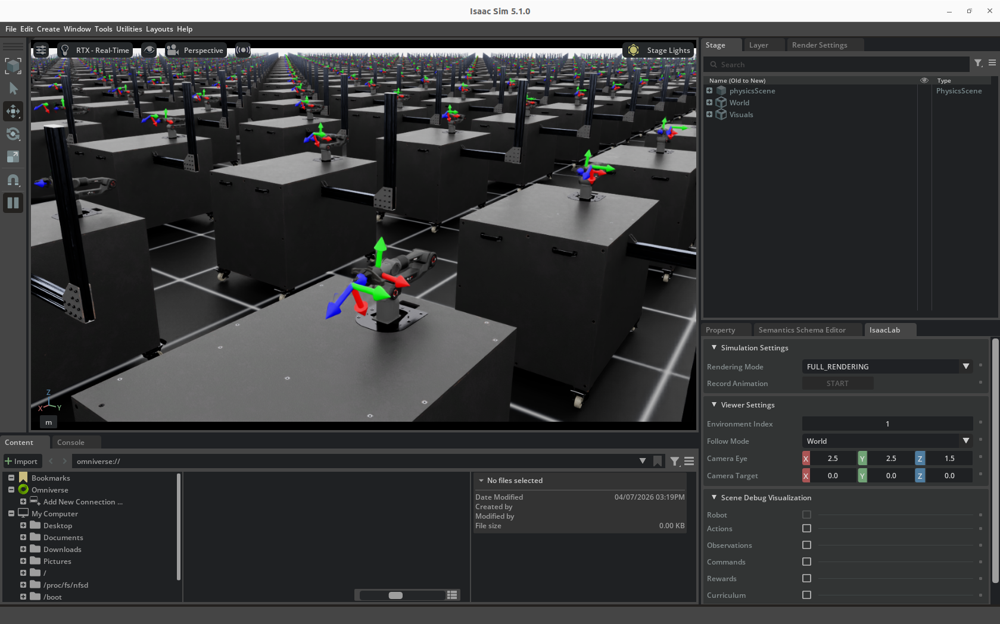

# 基于 Isaac Lab 的 Nero和Piper强化学习案例

在机器人研究领域，机械臂的智能控制一直是具身智能研究的核心方向之一。传统的运动学控制方案虽然稳定，但面对复杂的非结构化环境往往束手无策，而强化学习技术的出现，为机械臂实现自主适应环境、完成复杂任务提供了全新的可能。

今天我们要介绍的`isaac_so_arm101`项目，在原有 SO-ARM100 项目的基础上，完成了对松灵机器人旗下两款热门科研机械臂 ——Nero 七轴仿人臂与 Piper 六轴轻量臂的适配，让开发者可以快速基于 NVIDIA Isaac Lab 平台，开展机械臂的强化学习训练与验证。

## 一、项目安装与环境准备

项目采用了`uv`作为包管理工具，这是一款新一代的 Python 包管理工具，相比传统的 pip，它的安装速度更快，依赖解析更高效，还能自动管理虚拟环境，彻底解决了环境依赖混乱的问题。

### 1.1 安装 uv 包管理工具

首先我们需要安装 uv，只需要一行命令即可完成：

```bash
curl -LsSf https://astral.sh/uv/install.sh | sh
```

安装完成后，重启终端或者执行`source $HOME/.cargo/env`即可让 uv 命令生效。

### 1.2 克隆项目并安装依赖

接下来克隆本项目的仓库，然后进入项目目录，使用 uv 一键安装所有依赖：

```bash
git clone https://github.com/smalleha/isaac_so_arm101.git
cd isaac_so_arm101
uv sync
```

uv 会自动创建虚拟环境，并且下载安装所有需要的依赖包，整个过程只需要几分钟，比传统的 pip 安装快了数倍。

## 二、环境测试

安装完成后，我们可以先测试一下环境是否正常，首先可以列出所有已经适配好的环境，确认我们的 Nero 和 Piper 环境都在其中：

```bash
uv run list_envs
```

如果一切正常，你会在输出中看到`Isaac-Nero-Reach-v0`和`Isaac-Piper-Reach-v0`这两个我们需要的环境。

接下来，我们可以用虚拟智能体来测试一下环境是否可以正常运行，这一步可以帮我们验证仿真环境的加载是否正常：

```bash
# 测试Piper环境，发送零动作
uv run zero_agent --task SO-ARM100-Reach-Play-v0
```

如果仿真窗口正常弹出，机械臂可以正常运动，说明我们的环境已经准备就绪了。



## 三、从到达目标点到抓取方块

这个项目为我们提供了两个典型的强化学习任务，分别对应 Piper 和 Nero 两款机械臂，我们可以分别来体验一下。

### 5.1 Piper 的目标到达任务：学习逆运动学

首先我们来看 Piper 机械臂的目标到达任务，这个任务的目标是让机械臂学会自主控制关节，让末端执行器移动到指定的目标位置，本质上就是通过强化学习来学习逆运动学（IK）。

传统的逆运动学需要精确的机械臂模型，而且面对冗余自由度的机械臂往往会有多个解，而强化学习可以直接从数据中学习到端到端的控制策略，不仅不需要精确的模型，还能同时考虑避障、平滑运动等约束。

#### 训练策略

我们可以直接启动训练，使用`--headless`参数开启无头模式，这样可以关闭 GUI，大幅提升训练速度：

```bash
uv run train --task Isaac-Piper-Reach-v0 --headless
```

训练过程中，Isaac Lab 会自动并行运行多个环境，快速收集数据，更新 PPO 策略网络的参数。

#### 评估训练结果

训练完成后，我们就可以加载训练好的策略，看看它的表现了：

```bash
uv run play --task Isaac-Piper-Reach-v0
```

这时候你会看到，机械臂可以精准地把末端移动到随机生成的目标点，哪怕目标点不断变化，它也能快速响应，这就是强化学习训练出来的策略的威力。


### 5.2 Nero 的抓取任务：从仿真中学习操作

接下来我们来看更复杂的 Nero 机械臂的任务，这个任务不仅要求机械臂到达目标位置，还要完成对方块的抓取，并且把方块移动到指定的目标点，这是一个典型的手眼抓取任务，也是工业机器人最常用的任务之一。

#### 启动训练

对于这个更复杂的任务，我们可以调整并行环境的数量，来提升训练的效率，比如设置 64 个并行环境：

```bash
uv run train --task Isaac-Nero-Reach-v0 --num_envs 64
```

这里的`--num_envs`参数就是并行环境的数量，数值越大，数据收集的速度越快，训练的效率也就越高，当然这也会占用更多的 GPU 显存，如果你显存比较小，可以适当调低这个数值。

如果你想实时看到训练的过程，也可以去掉`--headless`参数，这样就能看到仿真窗口里，多个机械臂同时在进行训练尝试，非常直观。

#### 回放训练好的策略

训练完成后，我们同样可以用 play 命令来查看效果：

```bash
# 直接加载最新的检查点
uv run play --task Isaac-Nero-Reach-v0
# 也可以加载指定的检查点文件
uv run play --task Isaac-Nero-Reach-v0 --checkpoint /path/to/your/checkpoint.pt
```

这时候你就能看到，Nero 机械臂可以自主地识别方块的位置，移动夹爪，完成抓取，然后把方块放到目标位置，整个过程完全自主，不需要人工干预。


