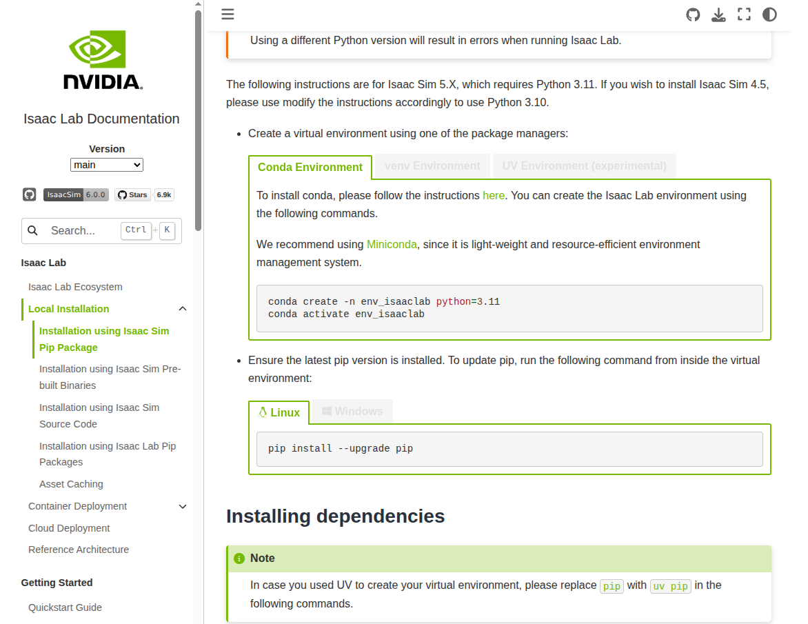
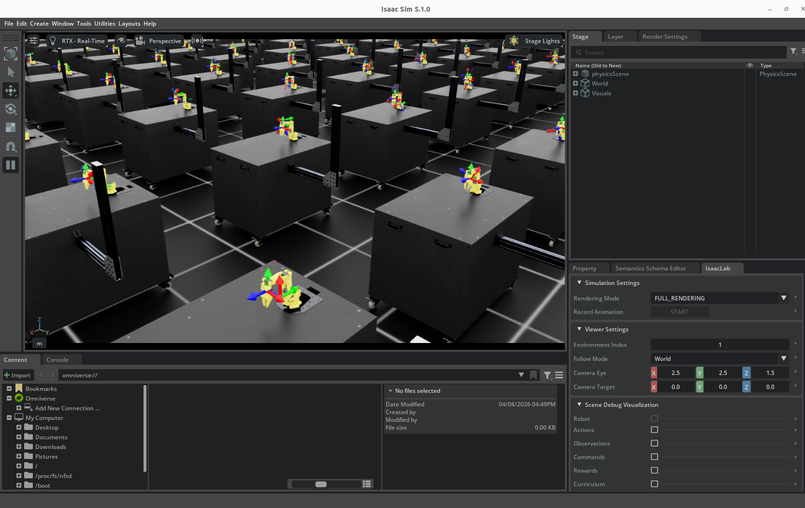

# Nero实用案例--基于 Isaac Lab 使用强化学习实现到达目标点

在机器人研究领域，机械臂的智能控制一直是具身智能研究的核心方向之一。传统的运动学控制方案虽然稳定，但面对复杂的非结构化环境往往束手无策，而强化学习技术的出现，为机械臂实现自主适应环境、完成复杂任务提供了全新的可能。

本项目在原有 [SO-ARM101](https://github.com/MuammerBay/isaac_so_arm101) 项目的基础上，适配了nero机械臂，让开发者可以快速基于 NVIDIA Isaac Lab 平台，开展机械臂的强化学习训练与验证。

## 一、项目安装与环境准备

### 1.1 安装IsaacLab

IsaacLab的安装方法可以参考官方给出的[教程](https://isaac-sim.github.io/IsaacLab/main/source/setup/installation/pip_installation.html)，本教程是使用pip 安装的，pip安装需要conda虚拟环境，大家可以自行安装



### 1.2 安装 uv 包管理工具

项目采用了`uv`作为包管理工具，这是一款新一代的 Python 包管理工具，相比传统的 pip，它的安装速度更快，依赖解析更高效，还能自动管理虚拟环境，彻底解决了环境依赖混乱的问题。

首先我们需要安装 uv，只需要一行命令即可完成：

```bash
curl -LsSf https://astral.sh/uv/install.sh | sh
```

安装完成后，重启终端或者执行`source $HOME/.cargo/env`即可让 uv 命令生效。

### 1.3 克隆项目并安装依赖

接下来克隆本项目的仓库，然后进入项目目录，使用 uv 一键安装所有依赖：

```bash
git clone https://github.com/smalleha/isaac_so_arm101.git
cd isaac_so_arm101
uv sync
```

uv 会自动创建虚拟环境，并且下载安装所有需要的依赖包，整个过程只需要几分钟，比传统的 pip 安装快了数倍。

## 二、环境测试

安装完成后，我们可以先测试一下环境是否正常，首先可以列出所有已经适配好的环境，确认我们的 Nero 和 Piper 环境都在其中：

```bash
uv run list_envs
```

如果一切正常，你会在输出中看到`Isaac-Nero-Reach-v0`和`Isaac-Piper-Reach-v0`这两个我们需要的环境。


接下来，我们可以用虚拟智能体来测试一下环境是否可以正常运行，这一步可以帮我们验证仿真环境的加载是否正常：

```bash
# 测试Piper环境，发送零动作
uv run zero_agent --task Isaac-SO-ARM100-Reach-v0
```

如果仿真窗口正常弹出，机械臂可以正常运动，说明我们的环境已经准备就绪了。



## 三、项目文件结构

```
isaac_so_arm101/
├── CITATION.cff                        # 项目引用信息配置文件，用于规范项目的学术引用格式
├── CONTRIBUTING.md                     # 项目贡献指南，说明如何参与项目开发、提交PR的规范
├── CONTRIBUTORS.md                     # 项目贡献者列表，记录所有参与项目开发的人员信息
├── LICENSE                             # BSD-3-Clause开源许可证，定义项目的开源使用规则
├── README.md                           # 项目核心说明文档，包含安装步骤、快速启动、任务介绍等内容
├── pyproject.toml                      # Python项目元数据配置，定义项目的依赖包、构建配置等
├── uv.lock                             # uv包管理器的依赖锁文件，锁定所有依赖的版本，保障环境可复现
└── src/                                # 项目源码根目录，存放所有项目的核心源码
    └── isaac_so_arm101/                # 项目主Python包，所有业务代码都封装在此包中
        ├── __init__.py                 # Python包初始化文件，标记该目录为可导入的Python模块
        ├── robots/                     # 机器人模型模块：存放SO-ARM100/101两款机械臂的仿真模型配置
        ├── scripts/                    # 运行脚本模块：存放项目的调试、训练、回放等可运行脚本
        ├── tasks/                      # 仿真任务模块：存放项目支持的reach/lift两个仿真任务的定义
        └── ui_extension_example.py     # Omniverse UI扩展示例：演示如何为仿真环境添加自定义界面扩展
```

通过这个树状文件结构图，能清楚看各个文件夹下存放的内容，方便之后添加nero案例。

## 四、下载URDF模型

agx_arm_urdf仓库中有关于松灵所有机械臂的URDF模型，下载下来之后需要单独将nero的模型拿出来放到robots文件夹中

```
git clone https://github.com/agilexrobotics/agx_arm_urdf.git
cd agx_arm_urdf/
cp -r nero/ isaac_so_arm101/robots
```

成功将nero/复制到isaac_so_arm101/robots后，需要修改一下nero_description.urdf，因为其中所使用的路径是ROS中常用的索引路径，在IsaacLab中识别不到，将所有link的mesh 文件的路径修改为相对路径；拿其中的base_link作为例子

**修改前**

```xml
    <link name="base_link">
        <inertial>
            <origin xyz="-0.00319465997 -0.00005467608 0.04321758463" rpy="0 0 0"/>
            <mass value="1.06458435"/>
            <inertia ixx="0.00102659855152" ixy="0.00000186219753" ixz="-0.00000295298037" iyy="0.00114399299508" iyz="-0.00000078763492" izz="0.00090872933022"/>
        </inertial>
        <visual>
            <origin xyz="0 0 0" rpy="0 0 0"/>
            <geometry>
                <mesh filename="package://agx_arm_description/agx_arm_urdf/nero/meshes/dae/base_link.dae"/>
            </geometry>
        </visual>
        <collision>
            <origin xyz="0 0 0" rpy="0 0 0"/>
            <geometry>
                <mesh filename="package://agx_arm_description/agx_arm_urdf/nero/meshes/base_link.stl"/>
            </geometry>
        </collision>
    </link>
```

**修改后**

```xml
    <link name="base_link">
        <inertial>
            <origin xyz="-0.00319465997 -0.00005467608 0.04321758463" rpy="0 0 0"/>
            <mass value="1.06458435"/>
            <inertia ixx="0.00102659855152" ixy="0.00000186219753" ixz="-0.00000295298037" iyy="0.00114399299508" iyz="-0.00000078763492" izz="0.00090872933022"/>
        </inertial>
        <visual>
            <origin xyz="0 0 0" rpy="0 0 0"/>
            <geometry>
                <mesh filename="../meshes/dae/base_link.dae"/>
            </geometry>
        </visual>
        <collision>
            <origin xyz="0 0 0" rpy="0 0 0"/>
            <geometry>
                <mesh filename="../meshes/base_link.stl"/>
            </geometry>
        </collision>
    </link>
```

## 五、配置IsaacLab文件

### 导入URDF

修改完urdf之后，需要编写一个python文件导入URDF模型，设置机械臂的电机属性，刚度，阻尼等参数，这个文件一般放置在nero 目录下src/isaac_so_arm101/robots/nero/nero.py；文件内容如下

```python
from pathlib import Path

import isaaclab.sim as sim_utils
from isaaclab.actuators import ImplicitActuatorCfg
from isaaclab.assets.articulation import ArticulationCfg

TEMPLATE_ASSETS_DATA_DIR = Path(__file__).resolve().parent

##
# Configuration
##

NERO_CFG = ArticulationCfg(
    spawn=sim_utils.UrdfFileCfg(
        fix_base=True,
        replace_cylinders_with_capsules=True,
        asset_path=f"{TEMPLATE_ASSETS_DATA_DIR}/urdf/nero_gripper.urdf",
        activate_contact_sensors=False, # set as false while waiting for capsule implementation
        rigid_props=sim_utils.RigidBodyPropertiesCfg(
            disable_gravity=False,
            max_depenetration_velocity=5.0,
        ),
        articulation_props=sim_utils.ArticulationRootPropertiesCfg(
            enabled_self_collisions=True,
            solver_position_iteration_count=8,
            solver_velocity_iteration_count=0,
        ),
        joint_drive=sim_utils.UrdfConverterCfg.JointDriveCfg(
            gains=sim_utils.UrdfConverterCfg.JointDriveCfg.PDGainsCfg(stiffness=0, damping=0)
        ),
    ),
    init_state=ArticulationCfg.InitialStateCfg(
        rot=(1.0, 0.0, 0.0, 0.0),
        joint_pos={
            "joint1": 0.0,
            "joint2": 0.0,
            "joint3": 0.0,
            "joint4": 2.0,
            "joint5": 0.0,
            "joint6": 0.0,
            "joint7": 0.0,
            "gripper_joint1": 0.05,
            "gripper_joint2": -0.05
        },
        # Set initial joint velocities to zero
        joint_vel={".*": 0.0},
    ),
    actuators={
            "arm": ImplicitActuatorCfg(
                joint_names_expr=["joint.*"],
                effort_limit=25.0, # 稍微限制出力，防止瞬间冲击
                velocity_limit=1.5,
                
                # 刚度 (Stiffness)：针对轻型臂 Piper 优化，不再追求极致硬度
                stiffness={
                    "joint1": 200.0, 
                    "joint2": 170.0,
                    "joint3": 120.0,
                    "joint4": 80.0,
                    "joint5": 50.0,
                    "joint6": 20.0,
                    "joint7": 10.0
                },
                
                # 阻尼 (Damping)：采用临界阻尼思路，比例设在 10% 左右
                damping={
                    "joint1": 100.0,
                    "joint2": 60.0,
                    "joint3": 70.0,
                    "joint4": 24.0,
                    "joint5": 20.0,
                    "joint6": 10.0,
                    "joint7": 5,
                },
            ),
        "gripper": ImplicitActuatorCfg(
            joint_names_expr=["gripper_joint1","gripper_joint2"],
            effort_limit_sim=22,  # Increased from 1.9 to 2.5 for stronger grip
            velocity_limit_sim=1.5,
            stiffness=800.0,  # Increased from 25.0 to 60.0 for more reliable closing
            damping=20.0,  # Increased from 10.0 to 20.0 for stability
        ),

        },


    soft_joint_pos_limit_factor=0.9,
)
```

然后还需要创建一个__ int__.py文件，初始化文件，标记该目录为Python子模块

### 创建tasks任务

在tasks/lift目录下创建两个文件nero_joint_pos_env_cfg.py和nero_lift_env_cfg.py

nero_joint_pos_env_cfg.py包含关节位置控制的环境配置，其中需要明确可控制关节和机械臂末端link，以及方块的基本信息

```python
# Copyright (c) 2024-2025, Muammer Bay (LycheeAI), Louis Le Lay
# All rights reserved.
#
# SPDX-License-Identifier: BSD-3-Clause
#
# Copyright (c) 2022-2025, The Isaac Lab Project Developers.
# All rights reserved.
#
# SPDX-License-Identifier: BSD-3-Clause

import isaaclab_tasks.manager_based.manipulation.lift.mdp as mdp
from isaaclab.assets import RigidObjectCfg

# from isaaclab.managers NotImplementedError
from isaaclab.sensors.frame_transformer.frame_transformer_cfg import (
    FrameTransformerCfg,
    OffsetCfg,
)
from isaaclab.sim.schemas.schemas_cfg import RigidBodyPropertiesCfg
from isaaclab.sim.spawners.from_files.from_files_cfg import UsdFileCfg
from isaaclab.utils import configclass
from isaaclab.utils.assets import ISAAC_NUCLEUS_DIR
from isaac_so_arm101.robots import SO_ARM100_CFG, SO_ARM101_CFG  # noqa: F401
# from isaac_so_arm101.tasks.lift.lift_env_cfg import LiftEnvCfg
from isaac_so_arm101.tasks.lift.nero_lift_env_cfg import LiftEnvCfg
from isaaclab.markers.config import FRAME_MARKER_CFG  # isort: skip
# from isaac_so_arm101.robots.piper_description.piper import PIPER_CFG
from isaac_so_arm101.robots.nero_description.nero import NERO_CFG
@configclass
class NeroLiftCubeEnvCfg(LiftEnvCfg):
    def __post_init__(self):
        # post init of parent
        super().__post_init__()

        # Set so arm as robot
        self.scene.robot = NERO_CFG.replace(prim_path="{ENV_REGEX_NS}/Robot")

        # override actions
        self.actions.arm_action = mdp.JointPositionActionCfg(
            asset_name="robot",
            joint_names=["joint1", "joint2", "joint3", "joint4", "joint5", "joint6","joint7" ],
            scale=0.5,
            use_default_offset=True,
        )
        self.actions.gripper_action = mdp.BinaryJointPositionActionCfg(
            asset_name="robot",
            joint_names=["gripper_joint1","gripper_joint2"],
            open_command_expr={"gripper_joint2": -0.05,"gripper_joint1":0.05},
            close_command_expr={"gripper_joint2": -0.001,"gripper_joint1":0.0},
        )   
        # Set the body name for the end effector
        self.commands.object_pose.body_name = ["gripper_base"]

        # Set Cube as object
        self.scene.object = RigidObjectCfg(
            prim_path="{ENV_REGEX_NS}/Object",
            init_state=RigidObjectCfg.InitialStateCfg(pos=[0.2, 0.0, 0.015], rot=[1, 0, 0, 0]),
            spawn=UsdFileCfg(
                usd_path=f"{ISAAC_NUCLEUS_DIR}/Props/Blocks/DexCube/dex_cube_instanceable.usd",
                scale=(0.5, 0.5, 0.5),
                rigid_props=RigidBodyPropertiesCfg(
                    solver_position_iteration_count=16,
                    solver_velocity_iteration_count=1,
                    max_angular_velocity=1000.0,
                    max_linear_velocity=1000.0,
                    max_depenetration_velocity=5.0,
                    disable_gravity=False,
                ),
            ),
        )

        # Listens to the required transforms
        marker_cfg = FRAME_MARKER_CFG.copy()
        marker_cfg.markers["frame"].scale = (0.05, 0.05, 0.05)
        marker_cfg.prim_path = "/Visuals/FrameTransformer"
        self.scene.ee_frame = FrameTransformerCfg(
            prim_path="{ENV_REGEX_NS}/Robot/base_link",
            debug_vis=True,
            visualizer_cfg=marker_cfg,
            target_frames=[
                FrameTransformerCfg.FrameCfg(
                    prim_path="{ENV_REGEX_NS}/Robot/gripper_base",
                    name="end_effector",
                    offset=OffsetCfg(
                        pos=[0.0, 0.0, 0.125],
                    ),
                ),
            ],
        )


@configclass
class NeroLiftCubeEnvCfg_PLAY(NeroLiftCubeEnvCfg):
    def __post_init__(self):
        # post init of parent
        super().__post_init__()
        # make a smaller scene for play
        self.scene.num_envs = 50
        self.scene.env_spacing = 2.5
        # disable randomization for play
        self.observations.policy.enable_corruption = False


```

nero_reach_env_cfg.py包含任务的基础环境配置，任务奖励、惩罚、策略、目标点位置、方块位置等都是在这里设置

```python
# Copyright (c) 2024-2025, Muammer Bay (LycheeAI), Louis Le Lay
# All rights reserved.
#
# SPDX-License-Identifier: BSD-3-Clause
#
# Copyright (c) 2022-2025, The Isaac Lab Project Developers.
# All rights reserved.
#
# SPDX-License-Identifier: BSD-3-Clause

from dataclasses import MISSING

import isaaclab.sim as sim_utils

# from . import mdp
import isaac_so_arm101.tasks.lift.mdp as mdp
from isaaclab.assets import (
    ArticulationCfg,
    AssetBaseCfg,
    DeformableObjectCfg,
    RigidObjectCfg,
)
from isaaclab.envs import ManagerBasedRLEnvCfg
from isaaclab.managers import CurriculumTermCfg as CurrTerm
from isaaclab.managers import EventTermCfg as EventTerm
from isaaclab.managers import ObservationGroupCfg as ObsGroup
from isaaclab.managers import ObservationTermCfg as ObsTerm
from isaaclab.managers import RewardTermCfg as RewTerm
from isaaclab.managers import SceneEntityCfg
from isaaclab.managers import TerminationTermCfg as DoneTerm
from isaaclab.scene import InteractiveSceneCfg
from isaaclab.sensors.frame_transformer.frame_transformer_cfg import FrameTransformerCfg
from isaaclab.sim.spawners.from_files.from_files_cfg import GroundPlaneCfg, UsdFileCfg
from isaaclab.utils import configclass
from isaaclab.utils.assets import ISAAC_NUCLEUS_DIR

# from isaaclab.utils.offset import OffsetCfg
# from isaaclab.utils.noise import AdditiveUniformNoiseCfg as Unoise
# from isaaclab.utils.visualizer import FRAME_MARKER_CFG
# from isaaclab.utils.assets import RigidBodyPropertiesCfg


##
# Scene definition
##


@configclass
class ObjectTableSceneCfg(InteractiveSceneCfg):
    """Configuration for the lift scene with a robot and a object.
    This is the abstract base implementation, the exact scene is defined in the derived classes
    which need to set the target object, robot and end-effector frames
    """

    # robots: will be populated by agent env cfg
    robot: ArticulationCfg = MISSING
    # end-effector sensor: will be populated by agent env cfg
    ee_frame: FrameTransformerCfg = MISSING
    # target object: will be populated by agent env cfg
    object: RigidObjectCfg | DeformableObjectCfg = MISSING

    # Table
    table = AssetBaseCfg(
        prim_path="{ENV_REGEX_NS}/Table",
        init_state=AssetBaseCfg.InitialStateCfg(pos=[0.5, 0, 0], rot=[0.707, 0, 0, 0.707]),
        spawn=UsdFileCfg(usd_path=f"{ISAAC_NUCLEUS_DIR}/Props/Mounts/SeattleLabTable/table_instanceable.usd"),
    )

    # plane
    plane = AssetBaseCfg(
        prim_path="/World/GroundPlane",
        init_state=AssetBaseCfg.InitialStateCfg(pos=[0, 0, -1.05]),
        spawn=GroundPlaneCfg(),
    )

    # lights
    light = AssetBaseCfg(
        prim_path="/World/light",
        spawn=sim_utils.DomeLightCfg(color=(0.75, 0.75, 0.75), intensity=3000.0),
    )


##
# MDP settings
##


@configclass
class CommandsCfg:
    """Command terms for the MDP."""

    object_pose = mdp.UniformPoseCommandCfg(
        asset_name="robot",
        body_name=MISSING,  # will be set by agent env cfg
        resampling_time_range=(5.0, 5.0),
        debug_vis=True,
        ranges=mdp.UniformPoseCommandCfg.Ranges(
            pos_x=(0.3, 0.35),
            pos_y=(-0.2, 0.2),
            pos_z=(0.2, 0.35),
            roll=(0.0, 0.0),
            pitch=(0.0, 0.0),
            yaw=(0.0, 0.0),
        ),
    )


@configclass
class ActionsCfg:
    """Action specifications for the MDP."""

    # will be set by agent env cfg
    arm_action: mdp.JointPositionActionCfg | mdp.DifferentialInverseKinematicsActionCfg = MISSING
    gripper_action: mdp.BinaryJointPositionActionCfg = MISSING


@configclass
class ObservationsCfg:
    """Observation specifications for the MDP."""

    @configclass
    class PolicyCfg(ObsGroup):
        """Observations for policy group."""

        joint_pos = ObsTerm(func=mdp.joint_pos_rel)
        joint_vel = ObsTerm(func=mdp.joint_vel_rel)
        object_position = ObsTerm(func=mdp.object_position_in_robot_root_frame)
        target_object_position = ObsTerm(func=mdp.generated_commands, params={"command_name": "object_pose"})
        actions = ObsTerm(func=mdp.last_action)

        def __post_init__(self):
            self.enable_corruption = True
            self.concatenate_terms = True

    # observation groups
    policy: PolicyCfg = PolicyCfg()


@configclass
class EventCfg:
    """Configuration for events."""

    reset_all = EventTerm(func=mdp.reset_scene_to_default, mode="reset")

    reset_object_position = EventTerm(
        func=mdp.reset_root_state_uniform,
        mode="reset",
        params={
            "pose_range": {"x": (0.1, 0.2), "y": (-0.1, 0.2), "z": (0.0, 0.0)},
            "velocity_range": {},
            "asset_cfg": SceneEntityCfg("object", body_names="Object"),
        },
    )


@configclass
class RewardsCfg:
    """Reward terms for the MDP."""

    reaching_object = RewTerm(func=mdp.object_ee_distance, params={"std": 0.05}, weight=1.0)

    lifting_object = RewTerm(func=mdp.object_is_lifted, params={"minimal_height": 0.025}, weight=15.0)

    object_goal_tracking = RewTerm(
        func=mdp.object_goal_distance,
        params={"std": 0.3, "minimal_height": 0.025, "command_name": "object_pose"},
        weight=16.0,
    )

    object_goal_tracking_fine_grained = RewTerm(
        func=mdp.object_goal_distance,
        params={"std": 0.05, "minimal_height": 0.025, "command_name": "object_pose"},
        weight=5.0,
    )

    # action penalty
    action_rate = RewTerm(func=mdp.action_rate_l2, weight=-1e-4)

    joint_vel = RewTerm(
        func=mdp.joint_vel_l2,
        weight=-1e-4,
        params={"asset_cfg": SceneEntityCfg("robot")},
    )


@configclass
class TerminationsCfg:
    """Termination terms for the MDP."""

    time_out = DoneTerm(func=mdp.time_out, time_out=True)

    object_dropping = DoneTerm(
        func=mdp.root_height_below_minimum, params={"minimum_height": -0.05, "asset_cfg": SceneEntityCfg("object")}
    )


@configclass
class CurriculumCfg:
    """Curriculum terms for the MDP."""

    action_rate = CurrTerm(
        func=mdp.modify_reward_weight, params={"term_name": "action_rate", "weight": -1e-1, "num_steps": 10000}
    )

    joint_vel = CurrTerm(
        func=mdp.modify_reward_weight, params={"term_name": "joint_vel", "weight": -1e-1, "num_steps": 10000}
    )


##
# Environment configuration
##


@configclass
class LiftEnvCfg(ManagerBasedRLEnvCfg):
    """Configuration for the lifting environment."""

    # Scene settings
    scene: ObjectTableSceneCfg = ObjectTableSceneCfg(num_envs=4096, env_spacing=2.5)
    # Basic settings
    observations: ObservationsCfg = ObservationsCfg()
    actions: ActionsCfg = ActionsCfg()
    commands: CommandsCfg = CommandsCfg()
    # MDP settings
    rewards: RewardsCfg = RewardsCfg()
    terminations: TerminationsCfg = TerminationsCfg()
    events: EventCfg = EventCfg()
    curriculum: CurriculumCfg = CurriculumCfg()

    def __post_init__(self):
        """Post initialization."""
        # general settings
        self.decimation = 2
        self.episode_length_s = 5.0
        self.viewer.eye = (2.5, 2.5, 1.5)
        # simulation settings
        self.sim.dt = 0.01  # 100Hz
        self.sim.render_interval = self.decimation

        self.sim.physx.bounce_threshold_velocity = 0.2
        self.sim.physx.bounce_threshold_velocity = 0.01
        self.sim.physx.gpu_found_lost_aggregate_pairs_capacity = 1024 * 1024 * 4
        self.sim.physx.gpu_total_aggregate_pairs_capacity = 16 * 1024
        self.sim.physx.friction_correlation_distance = 0.00625
```

然后需要在src/isaac_so_arm101/tasks/reach/__ init__.py中注册nero reach任务

```python
# Copyright (c) 2024-2025, Muammer Bay (LycheeAI), Louis Le Lay
# All rights reserved.
#
# SPDX-License-Identifier: BSD-3-Clause
#
# Copyright (c) 2022-2025, The Isaac Lab Project Developers.
# All rights reserved.
#
# SPDX-License-Identifier: BSD-3-Clause

import gymnasium as gym

from . import agents

##
# Register Gym environments.
##

gym.register(
    id="Isaac-SO-ARM100-Lift-Cube-v0",
    entry_point="isaaclab.envs:ManagerBasedRLEnv",
    kwargs={
        "env_cfg_entry_point": f"{__name__}.joint_pos_env_cfg:SoArm100LiftCubeEnvCfg",
        "rsl_rl_cfg_entry_point": f"{agents.__name__}.rsl_rl_ppo_cfg:LiftCubePPORunnerCfg",
    },
    disable_env_checker=True,
)

gym.register(
    id="Isaac-SO-ARM100-Lift-Cube-Play-v0",
    entry_point="isaaclab.envs:ManagerBasedRLEnv",
    kwargs={
        "env_cfg_entry_point": f"{__name__}.joint_pos_env_cfg:SoArm100LiftCubeEnvCfg_PLAY",
        "rsl_rl_cfg_entry_point": f"{agents.__name__}.rsl_rl_ppo_cfg:LiftCubePPORunnerCfg",
    },
    disable_env_checker=True,
)

gym.register(
    id="Isaac-SO-ARM101-Lift-Cube-v0",
    entry_point="isaaclab.envs:ManagerBasedRLEnv",
    kwargs={
        "env_cfg_entry_point": f"{__name__}.joint_pos_env_cfg:SoArm101LiftCubeEnvCfg",
        "rsl_rl_cfg_entry_point": f"{agents.__name__}.rsl_rl_ppo_cfg:LiftCubePPORunnerCfg",
    },
    disable_env_checker=True,
)

gym.register(
    id="Isaac-SO-ARM101-Lift-Cube-Play-v0",
    entry_point="isaaclab.envs:ManagerBasedRLEnv",
    kwargs={
        "env_cfg_entry_point": f"{__name__}.joint_pos_env_cfg:SoArm101LiftCubeEnvCfg_PLAY",
        "rsl_rl_cfg_entry_point": f"{agents.__name__}.rsl_rl_ppo_cfg:LiftCubePPORunnerCfg",
    },
    disable_env_checker=True,
)

gym.register(
    id="Isaac-Nero-Lift-Cube-v0",
    entry_point="isaaclab.envs:ManagerBasedRLEnv",
    kwargs={
        "env_cfg_entry_point": f"{__name__}.nero_joint_pos_env_cfg:NeroLiftCubeEnvCfg",
        "rsl_rl_cfg_entry_point": f"{agents.__name__}.rsl_rl_ppo_cfg:LiftCubePPORunnerCfg", 
        "rl_games_cfg_entry_point": f"{agents.__name__}:rl_games_ppo_cfg.yaml",

    },
    disable_env_checker=True,
)

```

## 六、训练reach任务

激活conda 环境

```
conda activate env_isaaclab
```

进入isaac_so_arm101目录

```
cd isaac_so_arm101
```

执行训练指令，采用无头模式，减小资源消耗

```
uv run train --task Isaac-Nero-Lift-Cube-v0 --headless
```

如果显卡性能比较强的可以使用以下命令时时查看训练效果

```
uv run train --task Isaac-Nero-Lift-Cube-v0
```

训练次数是1000次，当训练完成之后可以使用以下命令查看效果

```
uv run play --task Isaac-Nero-Lift-Cube-v0
```


