# Isaac_Sim 导入PiPER URDF

## 摘要

在Isaac Sim中导入piper urdf模型

## 标签

PiPER机械臂、Isaac Sim

## 仓库

- **导航仓库**: https://github.com/agilexrobotics/Agilex-College
- **项目仓库**: https://github.com/agilexrobotics/piper_isaac_sim.git

## 环境配置

- 操作系统：Ubuntu 24.04
- ROS版本：ROS2 jazzy
- 显卡：5090

### 安装显卡驱动

```
sudo apt update
sudo apt upgrade
sudo add-apt-repository ppa:graphics-drivers/ppa
sudo apt update
sudo ubuntu-drivers autoinstall
#重启
reboot
```

重启之后，可以使用以下命令，验证是否驱动是否安装成功

```
nvidia-smi
```

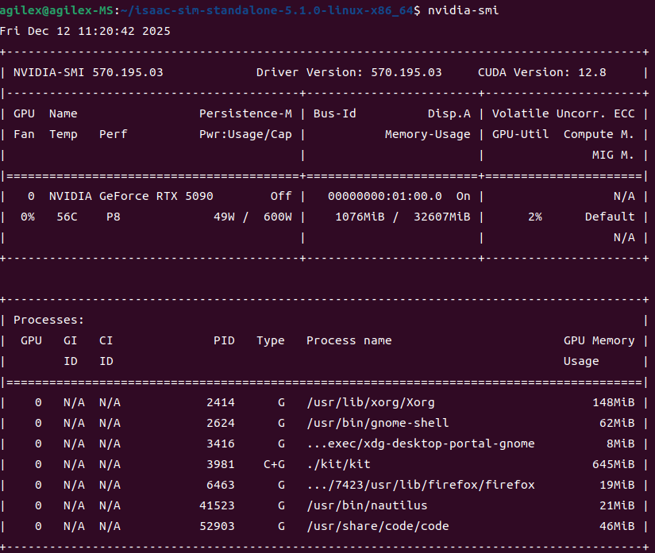

### 安装isaac sim

安装方法：https://docs.isaacsim.omniverse.nvidia.com/latest/installation/index.html

根据链接下载完之后，用以下方法解压

```
cd ~/Downloads
unzip "isaac-sim-standalone-5.1.0-linux-x86_64.zip" -d ~/
cd isaac-sim-standalone-5.1.0-linux-x86_64/
./post_install.sh
./isaac-sim.selector.sh
```

ROS Bridge Extension选择isaacsim.ros2.bridge；然后点击Start启动


成功打开后，就可以准备导入urdf模型了

> 

## 导入URDF

### 下载urdf模型

下载链接：https://github.com/agilexrobotics/piper_isaac_sim.git

> 后续会持续更新关于piper系列的urdf文件以及USD

打开isaac sim后；选择左上角的file->Import ；根据实际路径，选择导入的URDF模型

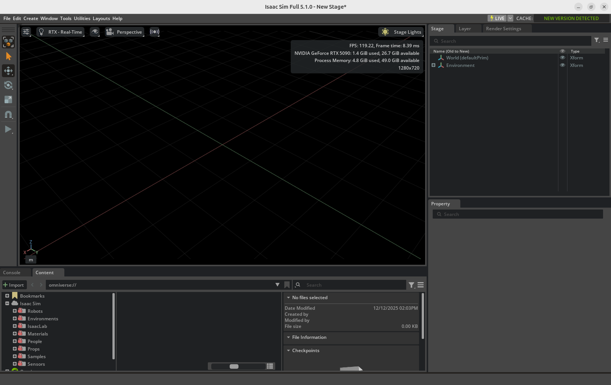

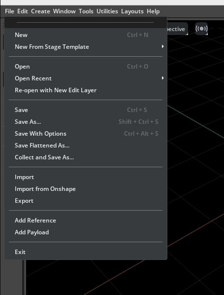

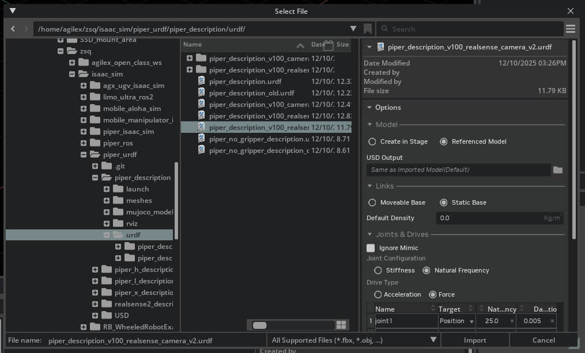

成功导入之后，可以看到机械臂出现在中心位置；可以增加个地面；提高亮度

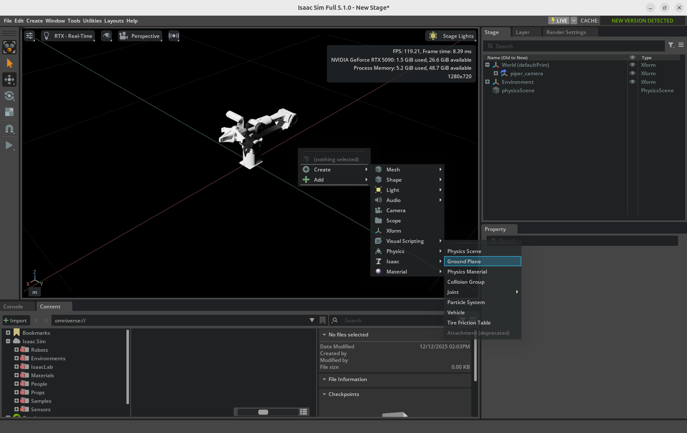

点击左边的三角按钮；开始仿真后，会发现夹爪会移动，这是因为导入的urdf中没有定义一些物理参数，需要在isaac sim中设置物理参数

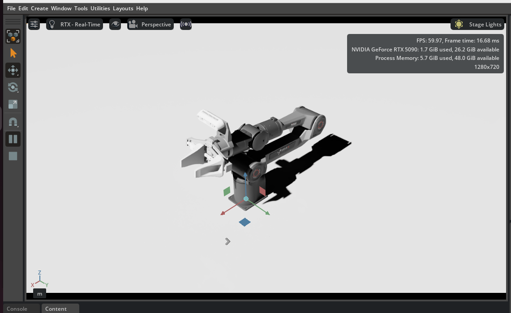

参数的设置方法如下，点开机械臂的joint1；将Drive->Angular 中的Damping 设置为80，Stiffness设置为400；将每个可移动的关节都设置一下

> 该参数仅供参考

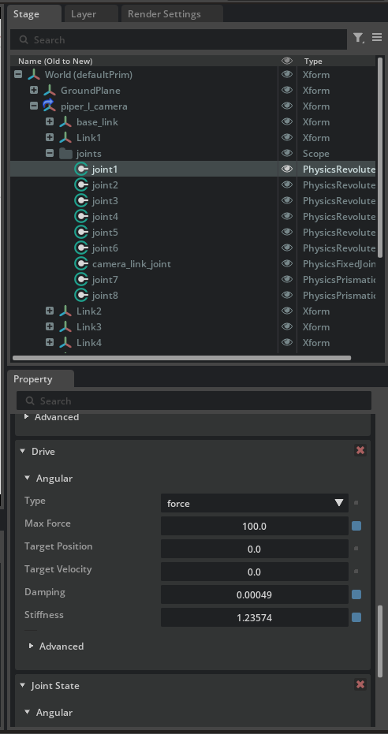


设置完成之后，再次开始仿真，机械臂就导入成功了

### 增加摄像头

在空白处右键，Create->Camera；创建一个新的相机视角

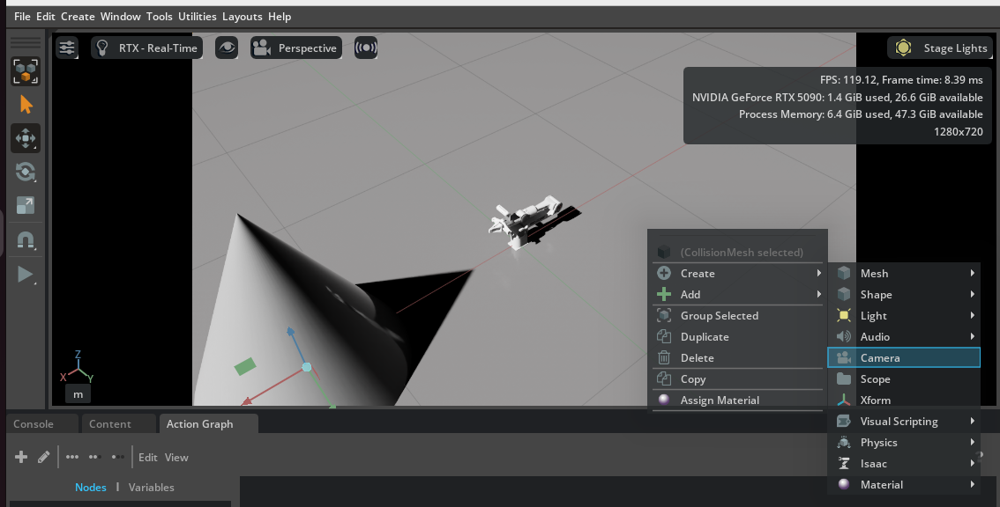

创建完成之后，需要在Property->Transform调整相机视角；然后在Visual->Visibility，选择invisible；将相机隐藏起来


在空白处右键，Create->Visual Scripting->Action Graph；创建一个Action Graph，需要将相机的视角通过ROS2发布出来

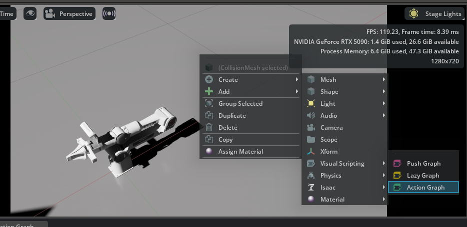

Action Graph中的内容如下图

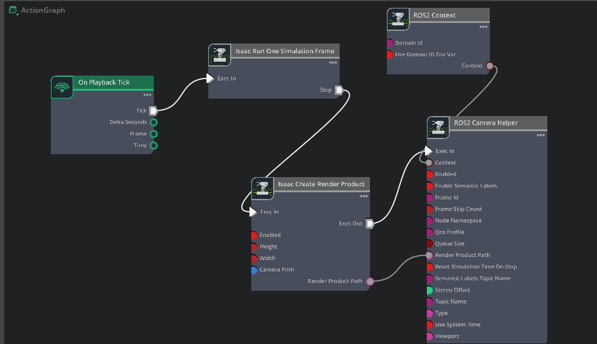

各个模块之前链接完成之后，需要设置一些参数

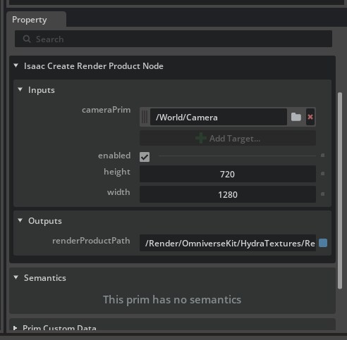

Isaac Create Render Product；camera Prim，需要选择新创建的相机视角

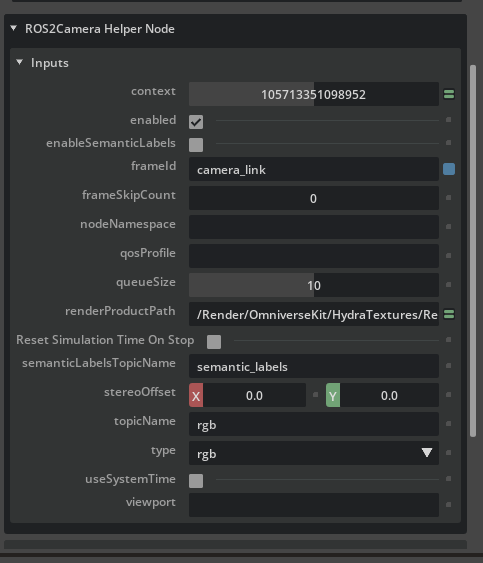

ROS2 Camera Helper ；其中可以设置相机话题的frame id和topicName

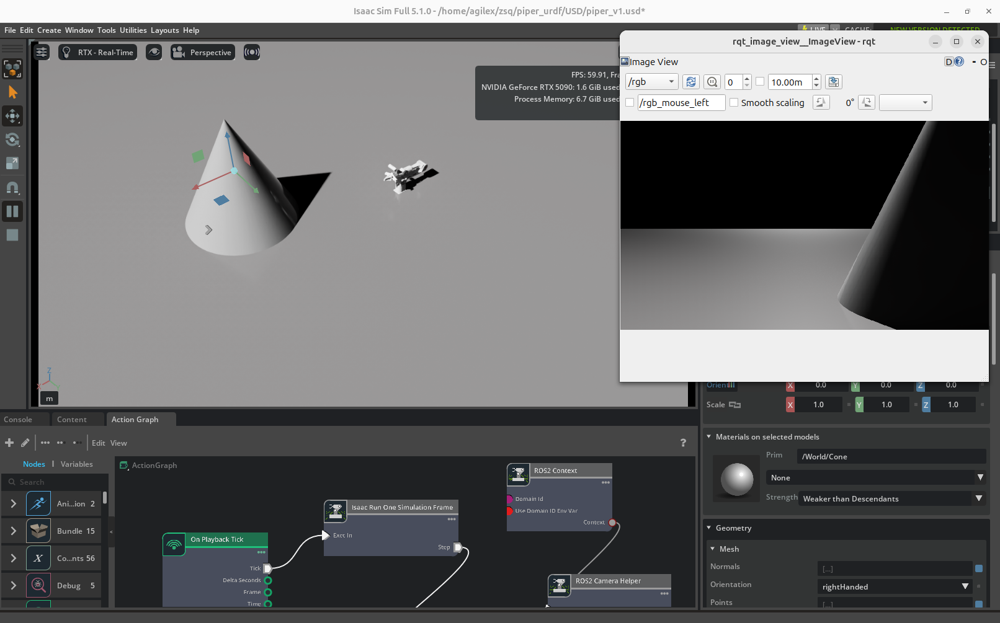

Ctrl+s保存一下USD模型，piper的USD模型就导入完成了。


