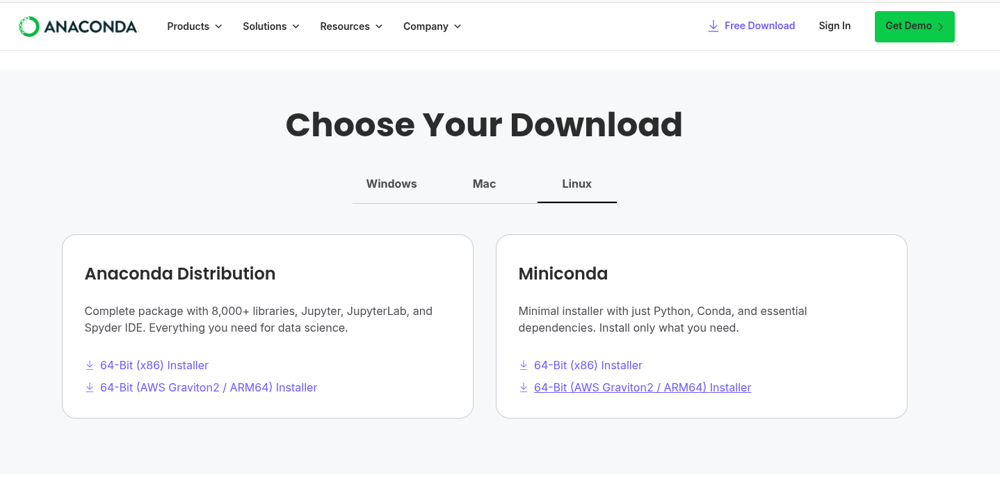
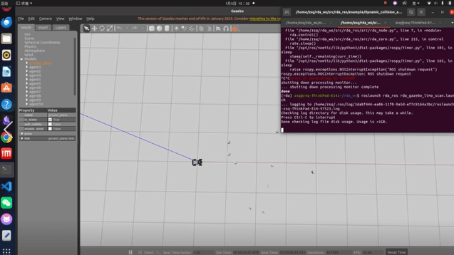

# RDA_planner 部署与实现

## 摘要

RDA_planner复现

## 标签

limo、RDA_planner、路径规划

## 仓库

- **导航仓库**: https://github.com/agilexrobotics/Agilex-College
- **项目仓库**: https://github.com/agilexrobotics/limo/RDA_planner.git

## 使用环境

系统：ubuntu 20.04

ROS版本：noetic

python版本：python3.9

## 部署过程

1、下载安装conda

[下载链接](https://www.anaconda.com/download/success)

根据系统空间大小选择下载Anaconda或者是Miniconda



下载完之后，输入以下命令安装

- Miniconda:

  ```
  bash Miniconda3-latest-Linux-x86_64.sh
  ```

- Anaconda:

  ```
  bash Anaconda-latest-Linux-x86_64.sh
  ```

2、创建conda环境并激活

```python
conda create -n rda python=3.9
conda activate rda
```

3、下载RDA_planner

```python
mkdir -p ~/rda_ws/src
cd ~/rda_ws/src
git clone https://github.com/hanruihua/RDA_planner
cd RDA_planner
pip install -e .  
```

4、下载仿真器
```python
pip install ir-sim
```

5、运行RDA_planner中的例子
```python
cd RDA_planner/example/lidar_nav
python lidar_path_track_diff.py
```

运行之后和官方readme的效果相同


# rda_ros部署过程

1、在conda环境下载依赖
```python 
conda activate rda
sudo apt install python3-empy
sudo apt install ros-noetic-costmap-converter
pip install empy==3.3.4
pip install rospkg
pip install catkin_pkg
```

2、下载代码
```python
cd ~/rda_ws/src
git clone https://github.com/hanruihua/rda_ros
cd ~/rda_ws && catkin_make
cd ~/rda_ws/src/rda_ros 
sh source_setup.sh && source ~/rda_ws/devel/setup.sh && rosdep install rda_ros 
```

3、下载仿真需要的组件

这里会下载两个仓库limo_ros和rvo_ros

limo_ros：仿真需要用的机器人模型

rvo_ros：仿真环境中使用到的圆柱障碍

```python
cd rda_ros/example/dynamic_collision_avoidance
sh gazebo_example_setup.sh
```

4、运行gazebo仿真

**使用脚本运行**

```python
cd rda_ros/example/dynamic_collision_avoidance
sh run_rda_gazebo_scan.sh
```

**使用单独命令运行**

启动仿真环境

```
roslaunch rda_ros gazebo_limo_env10.launch
```

启动rda_planner

```
roslaunch rda_ros rda_gazebo_limo_scan.launch
```




