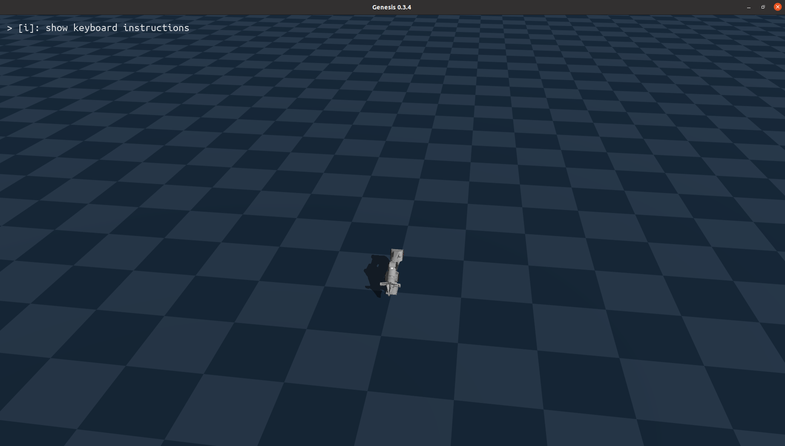
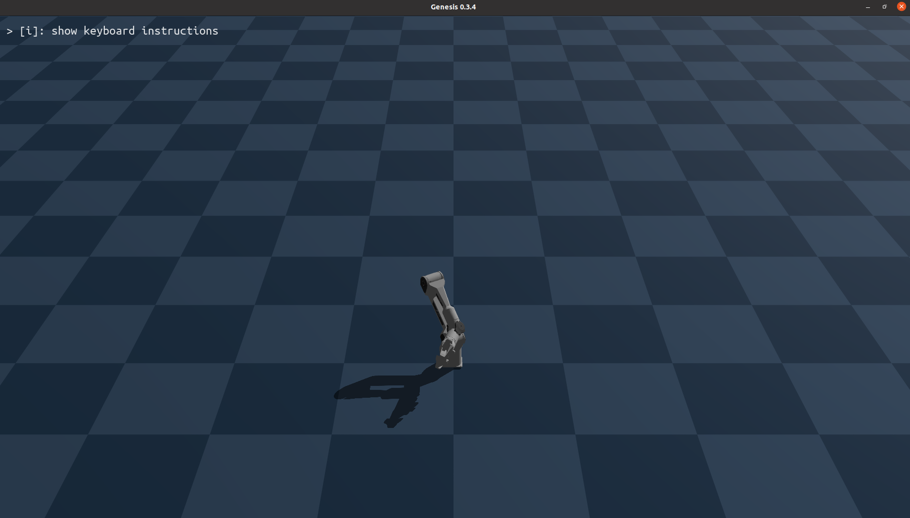
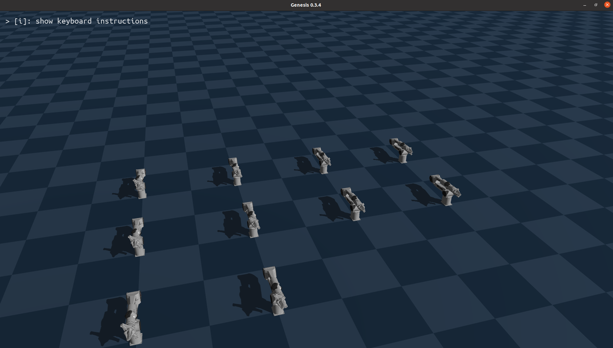
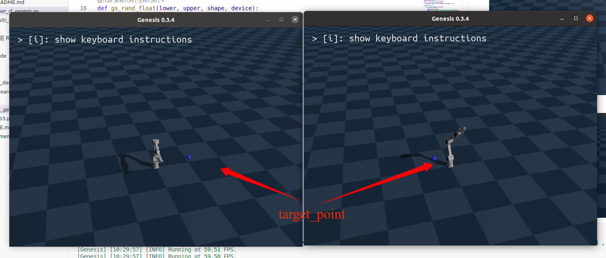
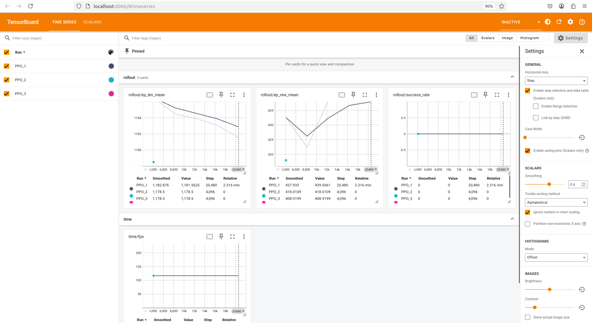
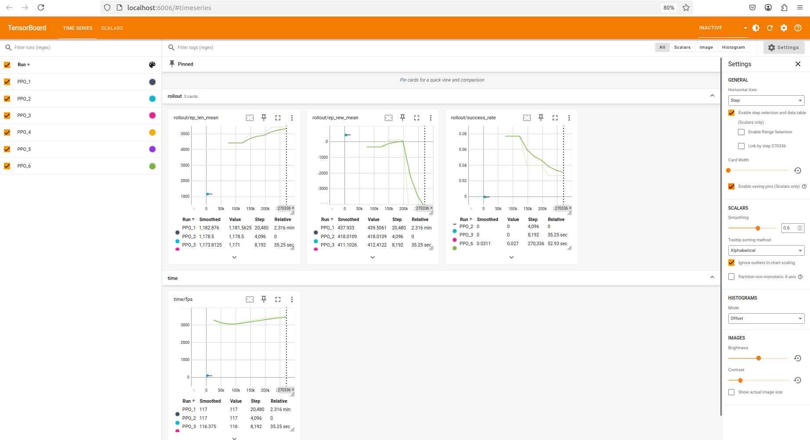
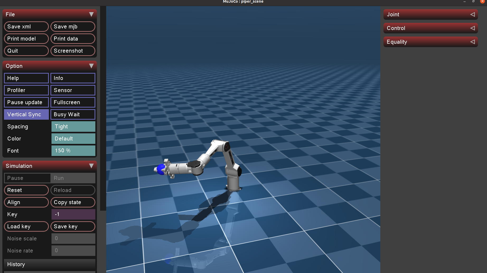
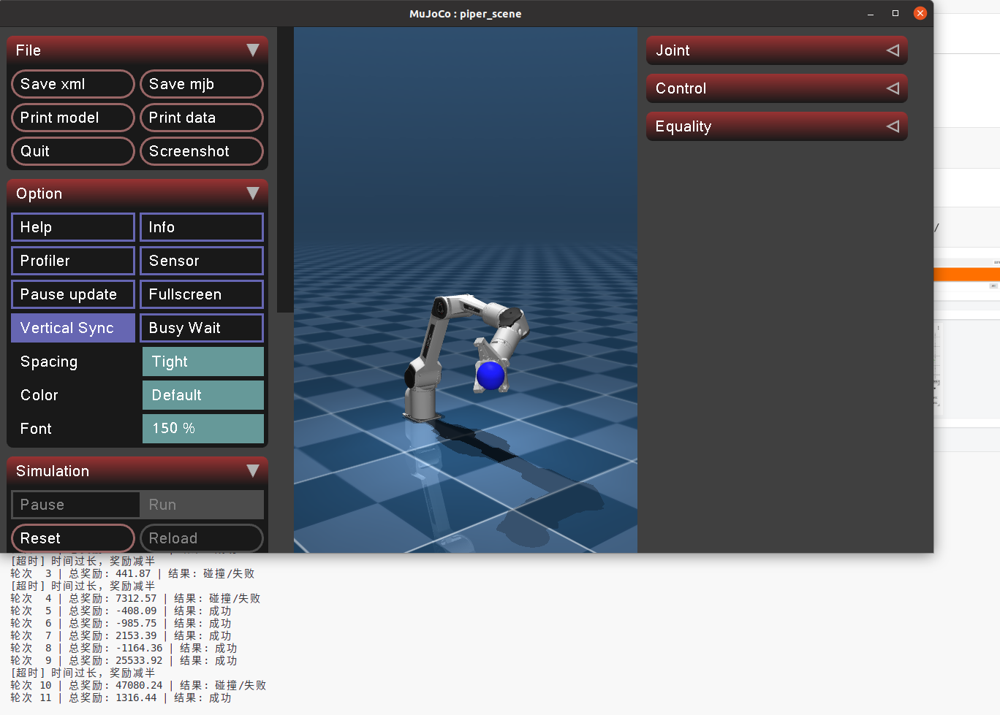

# Piper RL Demo
仓库包含了Piper RL的简单演示代码，演示了如何使用Piper RL训练一个简单的任务： Reach Target，任务要求Piper的夹爪中心到达指定的目标位置，而不要求Piper的末端姿态，用简单的奖励函数来实现这个任务。仓库提供了两种仿真器下的训练示例，分别是Mujoco和Genesis

## 仓库

[Piper_rl](https://github.com/vanstrong12138/Piper_rl.git)
[Agilex-College](https://github.com/agilexrobotics/Agilex-College.git)

## 环境依赖

- 安装RL相关的依赖

```bash
pip install -r requirements.txt
```

- 安装Genesis相关的依赖

1. Pytorch
安装Pytorch，根据自己的CUDA版本选择对应的安装命令，命令在[链接](https://pytorch.org/get-started/previous-versions/)中寻找相应cuda版本的pytorch。例如使用cuda12.9的版本，安装命令如下：
```bash
pip install torch==2.8.0 torchvision==0.23.0 torchaudio==2.8.0 --index-url https://download.pytorch.org/whl/cu129
```

2. Genesis World
安装Genesis World，命令如下：
```bash
pip install genesis-world
```

- 安装Mujoco
```bash
pip install mujoco==3.3.2
```

## Genesis 示例

### 在genesis中加载piper模型

运行genesis_demo/hello_genesis.py
```bash
python genesis_demo/hello_genesis.py
```
可以看见成功加载了Piper模型


### 在genesis中控制Piper模型

运行genesis_demo/control_piper.py
```bash
python genesis_demo/control_piper.py
```



可以看见piper根据设定的位置进行运动


### 在genesis中实现多个piper并行仿真

运行genesis_demo/multi_piper.py
```bash
python genesis_demo/multi_piper.py
```



### 在genesis中实现多个piper并行训练

运行piper_rl_genesis.py
```bash
python piper_rl_genesis.py
```
可以看见多个piper试图接近设定的位置


开启tensorboard可以看见训练过程中多个piper的奖励变化
```bash
tensorboard  --logdir tensorboard/piper_reach_target/
```


## 在genesis中实现piper env的基础步骤

1. 初始化env
```python
# 继承gym.Env更详细的方法参考OpenAI提供的gym示例
class PiperEnv(gym.Env):
  
    # __init__()：将会初始化环境以及初始化机器人的参数、动作空间与状态空间，便于强化学习算法在给定的状态空间中搜索合适的动作
    def __init__(self, visualize: bool = False):
        super(PiperEnv, self).__init__()

        self.visualize = visualize

        # 设置需要控制的关节索引
        self.jnt_name = [
            "joint1",
            "joint2",
            "joint3",
            "joint4",
            "joint5",
            "joint6"
        ]

        # 设置随机目标点的生成空间与piper机械臂的工作空间
        self.workspace = {
            'x': [-0.5, 1.5],
            'y': [-0.8, 0.8],
            'z': [0.05, 0.5]
        }

        # 设置环境的设备
        self.tensor_device = "cpu"
        self.gs_device = gs.cpu

        # 设置关节限位
        self.jnt_range = torch.tensor([
            [-2.61, 2.61],
            [0, 3.14],
            [-2.7, 0],
            [-1.83, 1.83],
            [-1.22, 1.22],
            [-1.57, 1.57]
        ], device=self.tensor_device)

        # piper机械臂关节的PD控制器参数
        self.kp = torch.tensor([4500, 4500, 3500, 3500, 2500.0, 2500.0], device=self.tensor_device)
        self.kv = torch.tensor([450.0, 450.0, 350.0, 350.0, 250.0, 250.0], device=self.tensor_device)

        gs.init(backend = self.gs_device)

        # 创建genesis场景
        self.scene = gs.Scene(
            # 设置相机
            show_viewer = self.visualize,
            viewer_options = gs.options.ViewerOptions(
                camera_pos    = (3.5, -1.0, 2.5),
                camera_lookat = (0.0, 0.0, 0.5),
                camera_fov    = 40,
            ),
            # 设置物理引擎
            rigid_options = gs.options.RigidOptions(
                dt = 0.01,
            ),
        )

        # 添加地面
        plane = self.scene.add_entity(
            gs.morphs.Plane(),
        )

        # 添加piper机器人
        self.robot = self.scene.add_entity(
            gs.morphs.MJCF(file='xml/agilex_piper/piper.xml'),
        )

        # 构建场景
        self.scene.build()

        # 初始姿态是piper机械臂的默认姿态，即所有关节角度为0
        self.default_joint_pos = torch.tensor([0.0, 0.0, 0.0, 0.0, 0.0, 0.0], device=self.tensor_device)
        # 定义末端执行器的位置x,y,z（实际当piper为初始姿态时，末端执行器的位置不为(0,0,0)）
        self.default_ee_pos = torch.tensor([0.0, 0.0, 0.0], device=self.tensor_device)

        # 定义动作空间与状态空间，确保关节的数值不会超过-PI到PI
        self.action_space = spaces.Box(low=-3.14, high=3.14, shape=(6,), dtype=np.float32)

        # 定义状态空间，包括6个关节角度、3个末端执行器位置
        self.observation_space = spaces.Box(low=-np.inf, high=np.inf, shape=(9,), dtype=np.float32)

        
        self.motors_dof_idx = [self.robot.get_joint(name).dof_start for name in self.jnt_name]
        self.robot.set_dofs_kp(self.kp, self.motors_dof_idx)
        self.robot.set_dofs_kv(self.kv, self.motors_dof_idx)

        self.goal = torch.tensor(torch.zeros(3, dtype=torch.float32), device=self.tensor_device)
        self.last_action = torch.tensor(torch.zeros(6, dtype=torch.float32), device=self.tensor_device)
        self.goal_threshold = 0.005
```

2. 设计奖励函数

```python
def calc_reward(self, action, obs):

        # 计算机械臂关节与目标位置的距离
        dist_to_goal = torch.linalg.norm(obs[6:] - self.goal)
        
        # 非线性距离奖励
        if dist_to_goal < self.goal_threshold:
            distance_reward = 100.0
        elif dist_to_goal < 2*self.goal_threshold:
            distance_reward = 50.0
        elif dist_to_goal < 3*self.goal_threshold:
            distance_reward = 10.0
        else:
            distance_reward = 1.0 / (1.0 + dist_to_goal)
        
        # 动作相关惩罚：惩罚关节大幅度变化
        action_diff = action - self.last_action
        smooth_penalty = 0.1 * torch.linalg.norm(action_diff)

        # 关节角度限制惩罚
        joint_penalty = 0.0
        for i in range(6):
            min_angle = self.jnt_range[i][0]
            max_angle = self.jnt_range[i][1]
            if obs[i] < min_angle:
                joint_penalty += 0.5 * (min_angle - obs[i])
            elif obs[i] > max_angle:
                joint_penalty += 0.5 * (obs[i] - max_angle)
        
        # 总奖励计算
        total_reward = distance_reward - smooth_penalty - joint_penalty
        # 更新上一步动作
        self.last_action = action.clone()
        
        return total_reward, dist_to_goal
```

3. 设置步进函数

```python
def step(self, action):
        action_tensor = torch.tensor(action, device=self.tensor_device, dtype=torch.float32)
        
        # 动作缩放: 归一化不同物理量纲的观测值.神经网络会对大数值特征更敏感，训练不稳定,通过缩放使所有观测值在相似范围内
        scaled_action = torch.zeros(6, device=self.tensor_device, dtype=torch.float32)
        for i in range(6):
            scaled_action[i] = self.jnt_range[i][0] + (action_tensor[i] + 1) * 0.5 * (self.jnt_range[i][1] - self.jnt_range[i][0])
        
        # genesis机器人执行动作
        self.robot.control_dofs_position(scaled_action, self.motors_dof_idx)
        # genesis场景模拟一步
        self.scene.step()

        # 观测
        obs = self.get_observation()

        # 计算奖励
        reward, dist_to_goal = self.calc_reward(action_tensor, obs)
        terminated = False
        if dist_to_goal < self.goal_threshold:
            terminated = True

        if not terminated:
            if time.time() - self.start_t > 20.0:
                reward -= 10.0
                print(f"[超时] 时间过长，奖励减半")
                terminated = True
        
        info = {
            'is_success': terminated and (dist_to_goal < self.goal_threshold),
            'distance_to_goal': dist_to_goal.item()
        }

        return obs.cpu().numpy(), reward.item(), terminated, False, info
```

## Mujoco示例

### 在mujoco中实现多个piper并行训练

运行piper_rl_mujoco.py
```bash
python piper_rl_mujoco.py
```

开启tensorboard可以看见训练过程中多个piper的奖励变化
```bash
tensorboard  --logdir tensorboard/piper_reach_target/
```


### 在mujoco中测试训练好的模型

运行piper_rl_mujoco.py
```bash
python piper_rl_mujoco.py
```

可以看到piper成功到达目标位置




## 参考

[https://github.com/LitchiCheng/mujoco-learning](https://github.com/LitchiCheng/mujoco-learning)
