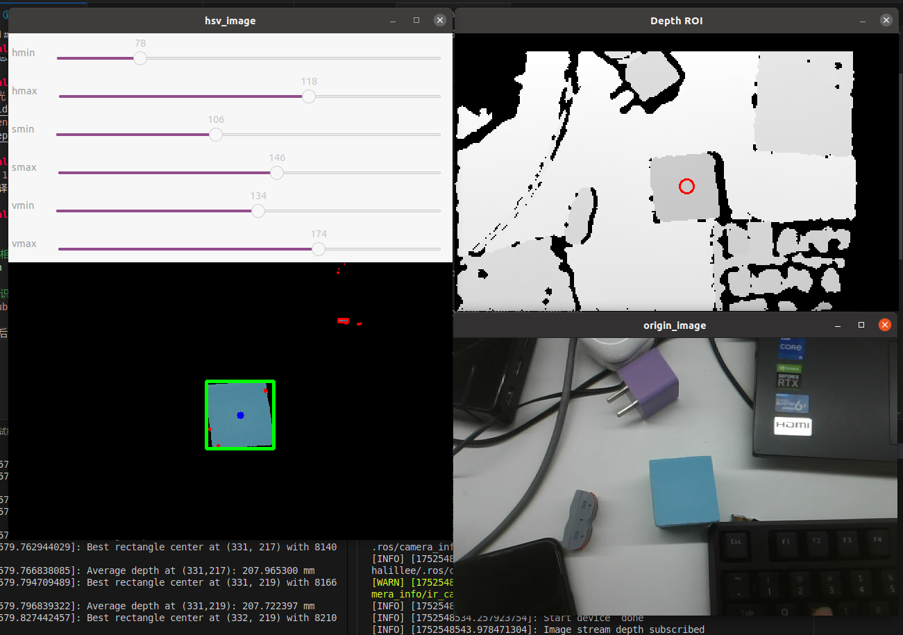
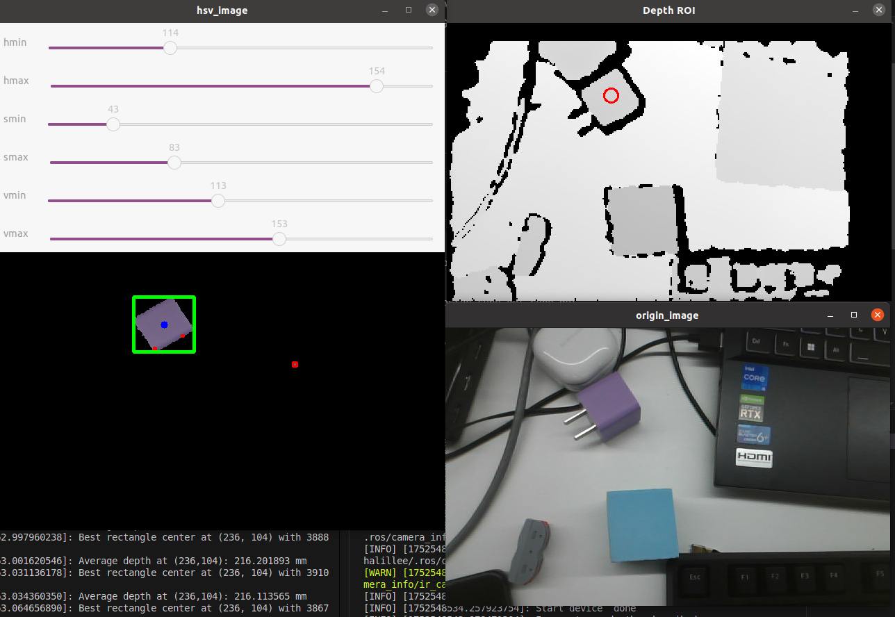

## <div align="center">简单色块识别及其三维坐标提取</div>      
一个简单的色块识别及其三维坐标提取的程序，使用OpenCV库，通过深度相机的深度信息与色彩信息进行识别，识别出的色块的三维坐标可以用于简单的机械臂抓取任务。

## <div align="center">硬件设备</div>
- [奥比中光 Petrel](https://orbbec.com.cn/index/Product/info.html?cate=38&id=28) 带对齐的深度图像与RGB图像：640*400@30fps
- [RealSense D435](https://realsenseai.com/stereo-depth-cameras/stereo-depth-camera-d435/)  带对齐的深度图像与RGB图像：640*480@30fps

## <div align="center">软件依赖</div>
- [pcl-1.10](https://github.com/PointCloudLibrary/pcl)  单独编译时需要指定编译on_nurbs选项

## <div align="center">运行</div>

````bash
# 首先启动相机驱动节点,以奥比中光Petrel为例
roslaunch astra_camera dabai_dc1.launch

# 启动色块识别节点
rosrun cubeAndLineDet cube_det
````
运行后出现三个OpenCV的图像窗口，其中用鼠标在origin_img图片上点击进行色块的选择，随后深度图会自动计算色块的平均深度并返回到方框中心坐标上，例如下图先在origin_img图片上点击青蓝色方块的位置，则其他两张图会自动找到色块位置并可视化

然后点击再次在origin_img窗口点击紫色方块的位置，其他两张图会自动找到色块位置并可视化



## <div align="center">单色曲线的三维坐标提取与拟合</div>      
一个简单的单色曲线的三维坐标提取与拟合的程序，使用OpenCV库，通过深度相机的深度信息与色彩信息进行识别，识别出的色块的三维坐标可以用于简单的机械臂寻迹任务。

## <div align="center">硬件设备</div>
- [RealSense D435](https://realsenseai.com/stereo-depth-cameras/stereo-depth-camera-d435/)  带对齐的深度图像与RGB图像：640*480@30fps
- [奥比中光 Petrel](https://orbbec.com.cn/index/Product/info.html?cate=38&id=28) 带对齐的深度图像与RGB图像：640*400@30fps

<font color="red">当前存在奥比中光款深度相机启动其ROS驱动节点时发布的camera_info参数与实际不匹配，需要标定后手动修改代码传入K矩阵，</font>RealSense没有这个问题。

## <div align="center">运行</div>

````bash
# 首先启动相机驱动节点,以RealSense D435为例，此节点已经有深度图与RGB图对齐功能
roslaunch realsense2_camera rs_aligned_depth.launch

# 启动单色曲线识别节点（不发布位置关系，只有曲线的三维点云可视化）
rosrun cubeAndLineDet line_det 
````

- 启动后可以看到三个OpenCV的窗口，其中用鼠标在origin_img图片上点击进行单色曲线的选择，随后深度图会自动计算单色曲线的平均深度并返回到方框中心坐标上，例如下图先在origin_img图片上点击桔黄色网线的位置，则其他两张图会自动找到单色曲线位置并可视化!

- 找到的单色曲线后，需要对检测结果进行去噪与拟合，其中去噪功能效果较好，但拟合效果较差，需要进一步优化<font color="yellow">(实验性)</font>

