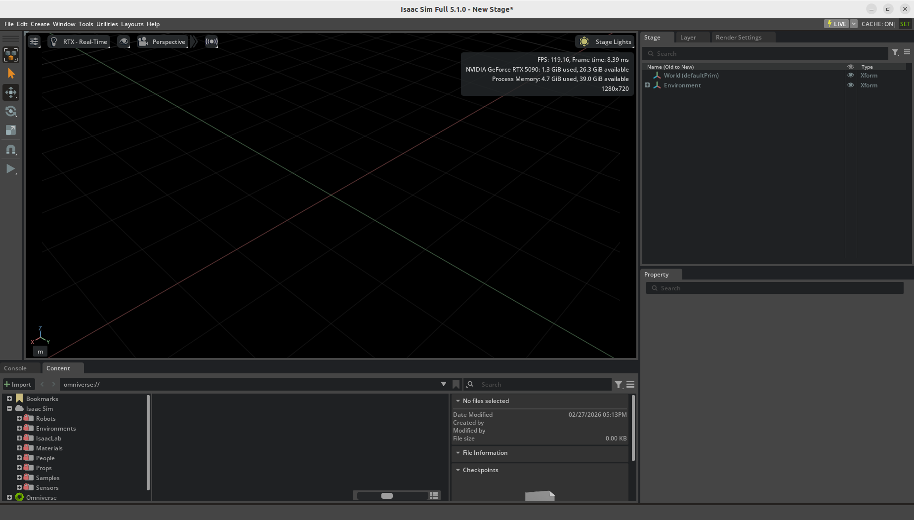
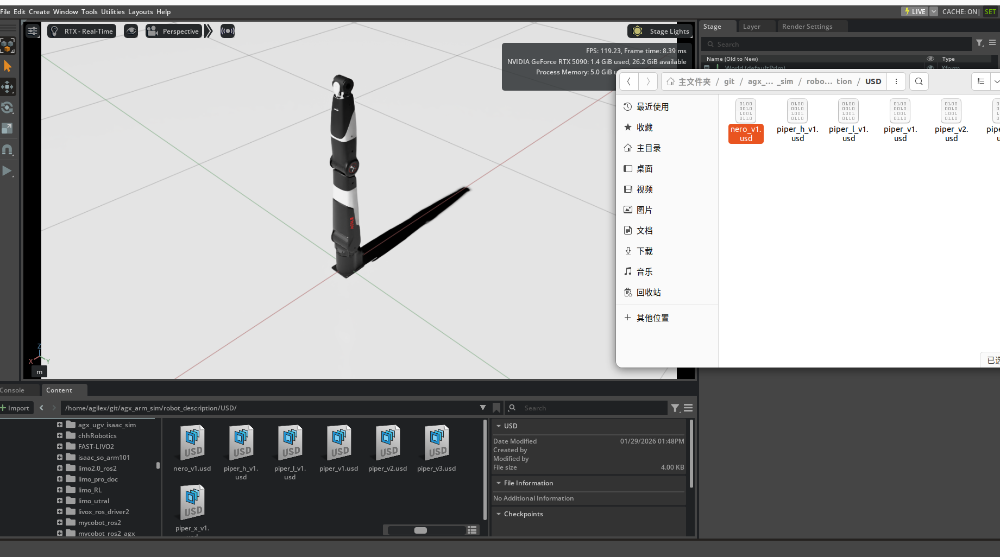
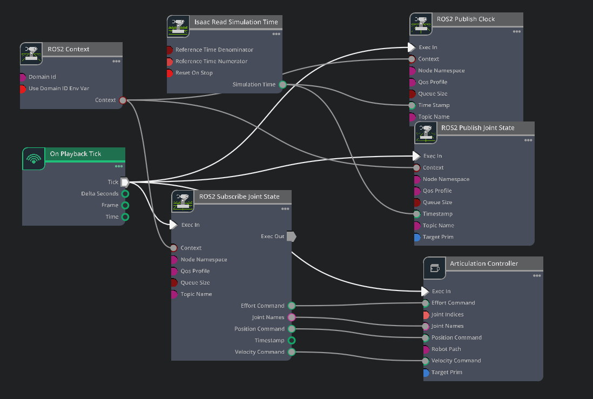
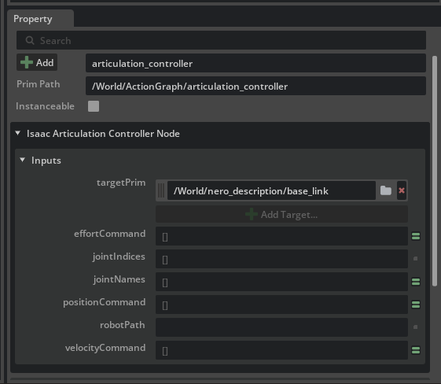
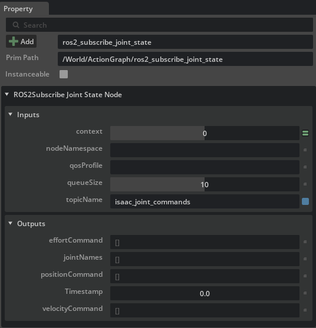
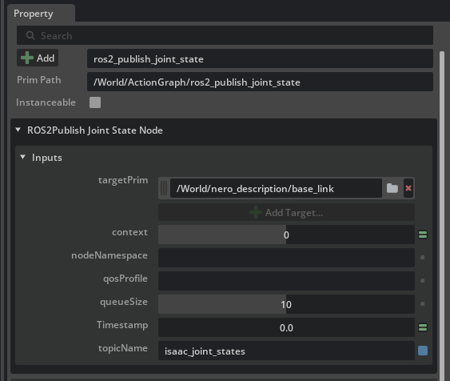
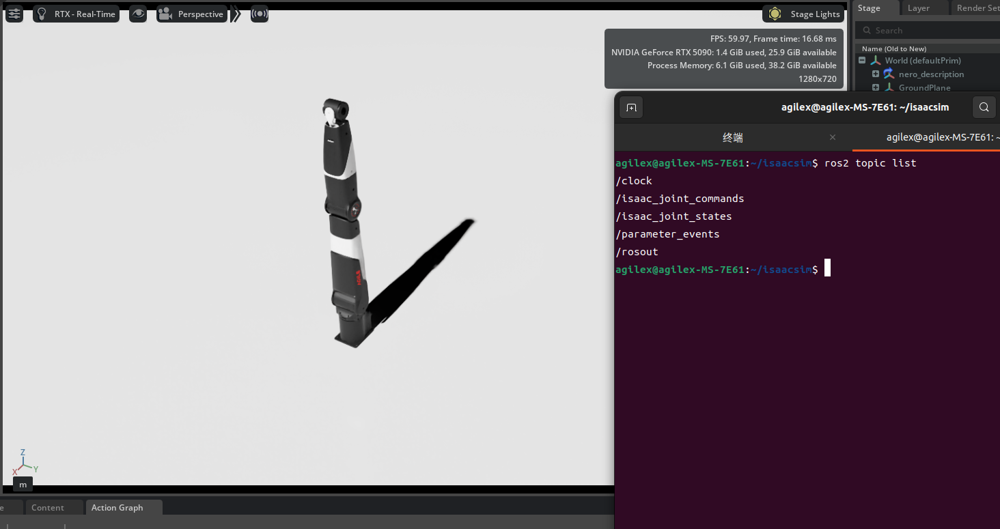
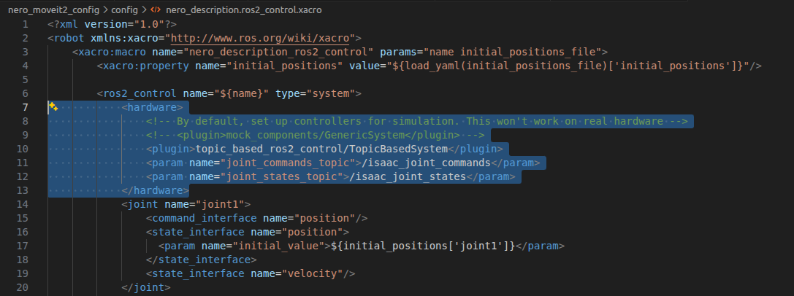
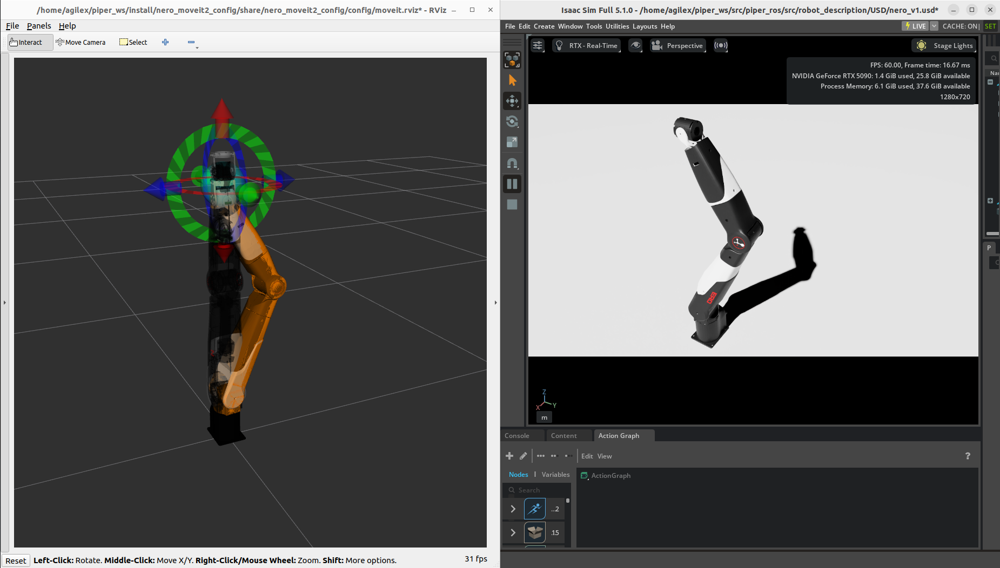

# 玩转nero--moveit2篇（二）

## 摘要

Moveit2与isaac sim联合仿真

## 标签

ROS2、moveit2、机械臂、nero

## 仓库

- **导航仓库**: https://github.com/agilexrobotics/Agilex-College
- **项目仓库**: https://github.com/agilexrobotics/piper/piper_moveit2.git

## 使用环境

系统：ubuntu 22.04

ROS版本：humble

Isaac Sim 版本： 5.1

## 下载USD模型

这里使用松灵提供的nero usd模型

```
cd ~/nero_ws/src
git clone https://github.com/agilexrobotics/agx_arm_sim
```

如果没有安装isaac sim或者想导入自己的urdf模型可以参考

[Isaac_Sim 导入PiPER URDF](https://github.com/agilexrobotics/Agilex-College/blob/master/isaac_sim/piper_isaac_sim/isaac_sim%20%E5%AF%BC%E5%85%A5piper%20urdf.md)

## 启动isaac sim

进入到isaac sim 的文件夹，使用脚本启动ROS Bridge Extension，然后点击start启动isaac sim

```
cd isaac-sim-standalone-5.1.0-linux-x86_64/
./isaac-sim.selector.sh
```



然后将刚下载的usd模型拖动到isaac sim中打开



在usd中，需要添加一个ActionGraph，用来和ROS端通信，ActionGraph如下



设置ActionGraph

articulation_controller
根据实际情况修改targetPrim；targetPrim，一般为/World/nero_description/base_link



ros2_subscribe_joint_state
topicName，需要根据实际修改；topicName需要与urdf对应上，这里为isaac_joint_commands



ros2_publish_joint_state
根据实际情况修改targetPrim，topicName，targetPrim一般为/World/nero_description/base_link；topicName需要与urdf对应上，这里为isaac_joint_states



开始仿真之后，在终端用ros2 topic list ；可以查看到以下话题



修改moveit功能包，打开nero_description.ros2_control.xacro，添加话题参数

```
gedit nero_ws/src/nero_moveit2_config/config/nero_description.ros2_control.xacro
```



            <hardware>
                <!-- By default, set up controllers for simulation. This won't work on real hardware -->
                <!-- <plugin>mock_components/GenericSystem</plugin> -->
                <plugin>topic_based_ros2_control/TopicBasedSystem</plugin>
                <param name="joint_commands_topic">/isaac_joint_commands</param>
                <param name="joint_states_topic">/isaac_joint_states</param>
            </hardware>

然后保存编译下代码，启动moveit2

```
cd ~/nero_ws
colcon build
source install/setup.bash
ros2 launch nero_moveit2_config demo.launch.py
```




