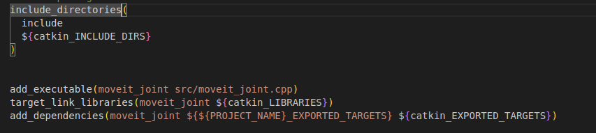

# 从零到玩转Moveit机械臂控制（三）

## 摘要

Moveit API使用

## 标签

ROS1、moveit、机械臂、Piper

## 仓库

- **导航仓库**: https://github.com/agilexrobotics/Agilex-College
- **项目仓库**: https://github.com/agilexrobotics/piper/piper_moveit.git

## 使用环境

系统：ubuntu 20.04

ROS版本：noetic

## Moveit——控制机械臂关节

在使用 **MoveIt** 进行机械臂控制时，`MoveGroupInterface` 是最常用、也是最简单高效的接口之一；使用C++调用Moveit API实现控制机械臂关节功能

创建一个名为piper_learnnig的功能包

```
cd ~/piper_ws/src
catkin_create_pkg piper_learnning roscpp rospy std_msgs moveit_ros_planning_interface
```

在piper_learnnig/src下创建一个名为moveit_joint的cpp文件；将以下代码填入moveit_joint.cpp中

```
// 导入ROS头文件
#include <ros/ros.h>
// 导入move_group_interface头文件
#include <moveit/move_group_interface/move_group_interface.h>

// 主函数
int main(int argc, char** argv)
{
    // 初始化ROS节点
    ros::init(argc, argv, "moveit_joint");

    // 异步消息处理器，设置线程数为1
    ros::AsyncSpinner spinner(1);
    
    // 启动异步消息处理器
    spinner.start();

    // move_group接口，选择机械臂为"arm"
	moveit::planning_interface::MoveGroupInterface move_group("arm");
    //获取终端link的名称
    std::string end_effector_link = move_group.getEndEffectorLink();
   //设置目标位置所使用的参考坐标系
    geometry_msgs::Pose start_pose = move_group.getCurrentPose(end_effector_link).pose;
    //当运动规划失败后，允许重新规划
    move_group.allowReplanning(true);

    //设置位置(单位：米)和姿态（单位：弧度）的允许误差
    move_group.setGoalPositionTolerance(0.001);
    move_group.setGoalOrientationTolerance(0.01);

    //设置允许的最大速度和加速度
    move_group.setMaxAccelerationScalingFactor(0.2);
    move_group.setMaxVelocityScalingFactor(0.2);

    // 控制机械臂先回到初始化位置
    move_group.setNamedTarget("zero");
    move_group.move();
    sleep(1);

    // 声明一个double 型元素的vector容器 
    std::vector<double> joint_values(6);

    // 把关节运动位置填入vector容器 
    // joint_values[0]=-0.39441719709048184;
    // joint_values[1]= 0.4228564717254736;
    // joint_values[2]= 0.5897185686390605;
    // joint_values[3]= 0.5897185686390605;
    // joint_values[4]= 0.5897185686390605;
    joint_values[5]= 0.5897185686390605;

    // 设置运动目标
    move_group.setJointValueTarget(joint_values); 

    ROS_INFO("move");
    // 执行运动
    move_group.move(); 

    // 停止异步消息处理器
    spinner.stop();

    // 关闭ROS节点
    ros::shutdown();
    
    // 返回0，程序结束
    return 0;
}
```

编辑CMakeLists文件，在末尾添加上以下代码

```
include_directories(
  include
  ${catkin_INCLUDE_DIRS}
)


add_executable(moveit_joint src/moveit_joint.cpp)
target_link_libraries(moveit_joint ${catkin_LIBRARIES})
add_dependencies(moveit_joint ${${PROJECT_NAME}_EXPORTED_TARGETS} ${catkin_EXPORTED_TARGETS})

```



编译代码

```
cd ~/piper_ws/
catkin_make
```

编译通过后，就可以启动moveit，尝试控制机械臂了

```
roslaunch piper_x_moveit_config demo.launch
rosrun piper_learnning moveit_joint
```


