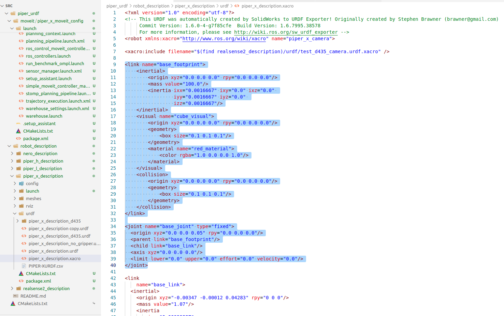
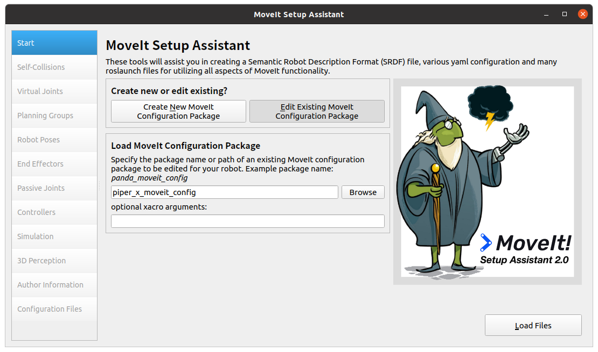
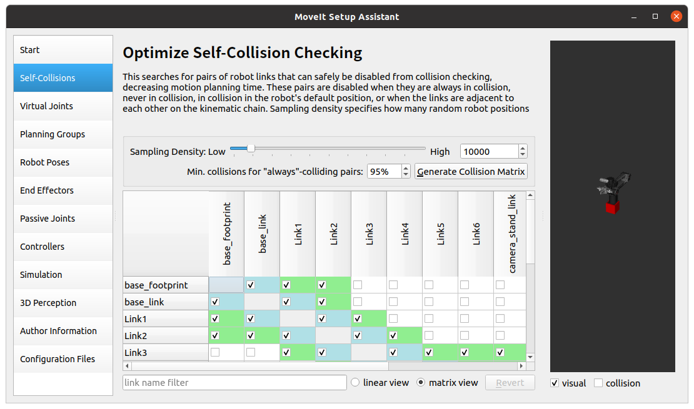
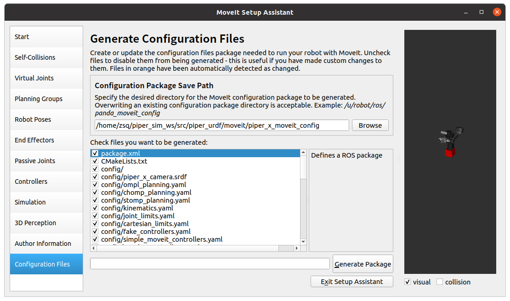
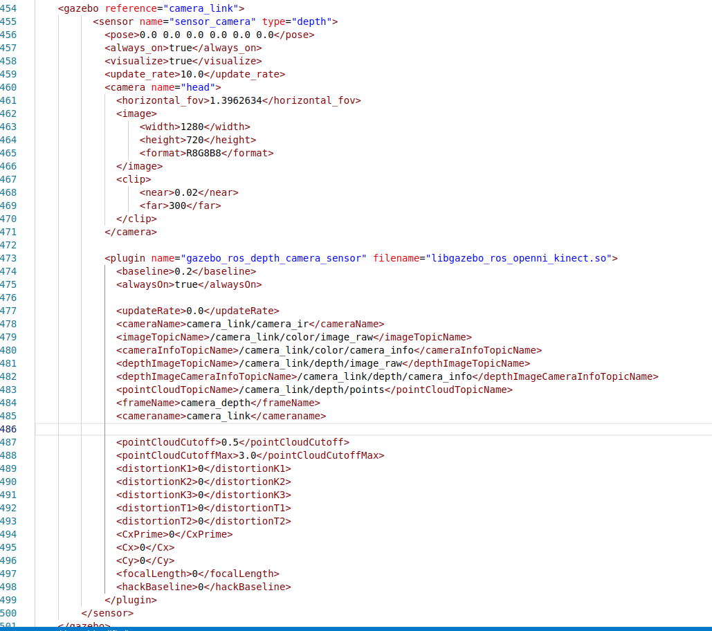
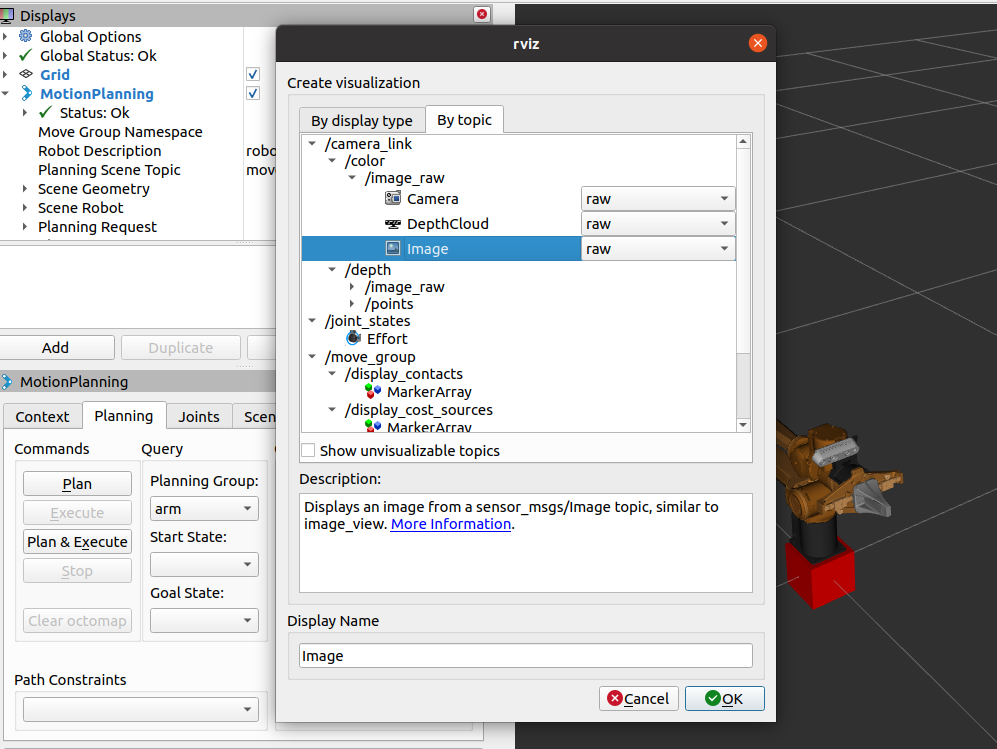

# 从零到玩转Moveit机械臂控制（二）

## 摘要

Moveit与Gazebo联合仿真

## 标签

ROS1、moveit、机械臂

## 仓库

- **导航仓库**: https://github.com/agilexrobotics/Agilex-College
- **项目仓库**: https://github.com/agilexrobotics/piper/piper_moveit.git

## 使用环境

系统：ubuntu 20.04

ROS版本：noetic

## Moveit与Gazebo联合仿真

### 环境安装

这些是使用到Gazebo时使用到的一些库

```
sudo apt-get install ros-noetic-gazebo-ros ros-noetic-gazebo-ros-control ros-noetic-gazebo-ros-pkgs ros-noetic-control-* ros-noetic-velodyne* ros-noetic-roboticsgroup-upatras-gazebo-plugins ros-noetic-robotis-manipulator ros-noetic-effort-controllers ros-noetic-joint-trajectory-action ros-noetic-joint-state-controller ros-noetic-position-controllers ros-noetic-effort-controllers ros-noetic-gripper-action-controller ros-noetic-joint-trajectory-controller
```

### 增加底座

上一篇我们导出了Moveit的功能包，接下来我们需要根据Gazebo修改一下URDF；给机械臂增加一个底座，以免模型在仿真时出现高频的震动

打开piper_x_description.xacro；在base_link前增加以下代码

> piper_x_description.xacro所在路径为/home/zsq/piper_sim_ws/src/piper_urdf/robot_description/piper_x_description/urdf/piper_x_description.xacro；根据实际路径打开

```
<link name="base_footprint">
    <inertial>
        <origin xyz="0.0 0.0 0.0" rpy="0.0 0.0 0.0"/>
        <mass value="100.0"/>
        <inertia ixx="0.0016667" ixy="0.0" ixz="0.0" 
                 iyy="0.0016667" iyz="0.0" 
                 izz="0.0016667"/>
    </inertial>
    <visual name="cube_visual">
        <origin xyz="0.0 0.0 0.0" rpy="0.0 0.0 0.0"/>
        <geometry>
            <box size="0.1 0.1 0.1"/>
        </geometry>
        <material name="red_material">
            <color rgba="1.0 0.0 0.0 1.0"/>
        </material>
    </visual>
    <collision>
        <origin xyz="0.0 0.0 0.0" rpy="0.0 0.0 0.0"/>
        <geometry>
            <box size="0.1 0.1 0.1"/>
        </geometry>
    </collision>
</link>

<joint name="base_joint" type="fixed">
  <origin xyz="0.0 0.0 0.05" rpy="0.0 0.0 0.0"/>
  <parent link="base_footprint"/>
  <child link="base_link"/>
  <axis xyz="0.0 0.0 0.0"/>
  <limit lower="0.0" upper="0.0" effort="0.0" velocity="0.0"/>
</joint>

```



### 更新Moveit包

增加代码之后我们需要更新以下Moveit包，使用以下命令启动

```
roslaunch piper_x_moveit_config setup_assistant.launch
```

点击Load Files



重新计算以下碰撞模型即可



然后输出Moveit功能包



因为Moveit已经帮我们配置完关于contrllers的部分，可以直接使用

```
roslaunch piper_x_moveit_config demo_gazebo.launch
```

> 如果运行失败，可能是缺少某些库，可以根据报错自行下载安装即可


### 增加相机插件

机械臂是有携带相机模型的，想在gazebo中查看图像，需要在URDF中添加相机的相关插件；demo_gazebo.launch中使用的是piper_x_moveit_config/config/gazebo_piper_x_camera.urdf；打开gazebo_piper_x_camera.urdf，在末尾增加以下代码

```
    <gazebo reference="camera_link">
          <sensor name="sensor_camera" type="depth">
            <pose>0.0 0.0 0.0 0.0 0.0 0.0</pose>
            <always_on>true</always_on>
            <visualize>true</visualize>
            <update_rate>10.0</update_rate>
            <camera name="head">
              <horizontal_fov>1.3962634</horizontal_fov>
              <image>
                  <width>1280</width>
                  <height>720</height>
                  <format>R8G8B8</format>
              </image>
              <clip>
                  <near>0.02</near>
                  <far>300</far>
              </clip>
            </camera>

            <plugin name="gazebo_ros_depth_camera_sensor" filename="libgazebo_ros_openni_kinect.so">
              <baseline>0.2</baseline>
              <alwaysOn>true</alwaysOn>

              <updateRate>0.0</updateRate>
              <cameraName>camera_link/camera_ir</cameraName>
              <imageTopicName>/camera_link/color/image_raw</imageTopicName>
              <cameraInfoTopicName>/camera_link/color/camera_info</cameraInfoTopicName>
              <depthImageTopicName>/camera_link/depth/image_raw</depthImageTopicName>
              <depthImageCameraInfoTopicName>/camera_link/depth/camera_info</depthImageCameraInfoTopicName>
              <pointCloudTopicName>/camera_link/depth/points</pointCloudTopicName>
              <frameName>camera_depth</frameName>
              <cameraname>camera_link</cameraname>
              
              <pointCloudCutoff>0.5</pointCloudCutoff>
              <pointCloudCutoffMax>3.0</pointCloudCutoffMax>
              <distortionK1>0</distortionK1>
              <distortionK2>0</distortionK2>
              <distortionK3>0</distortionK3>
              <distortionT1>0</distortionT1>
              <distortionT2>0</distortionT2>
              <CxPrime>0</CxPrime>
              <Cx>0</Cx>
              <Cy>0</Cy>
              <focalLength>0</focalLength>
              <hackBaseline>0</hackBaseline>
            </plugin>
        </sensor>
    </gazebo>
```



成功添加之后，再次启动Gazebo仿真，然后在Rviz中添加图像

```
roslaunch piper_x_moveit_config demo_gazebo.launch
```




